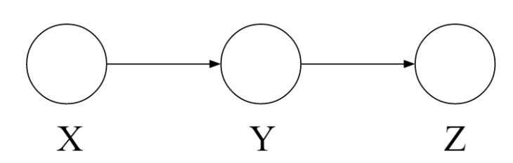
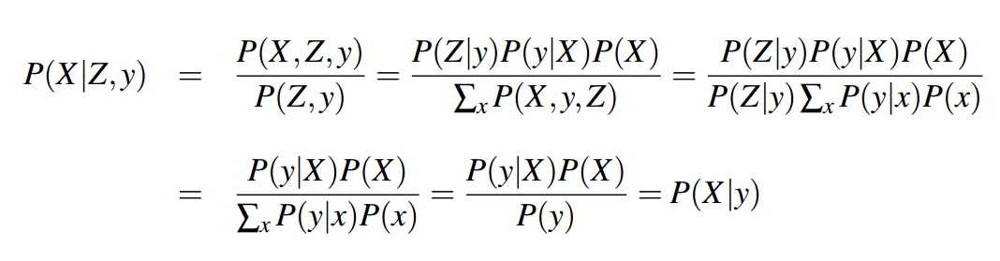
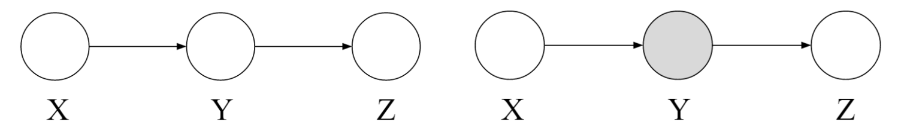
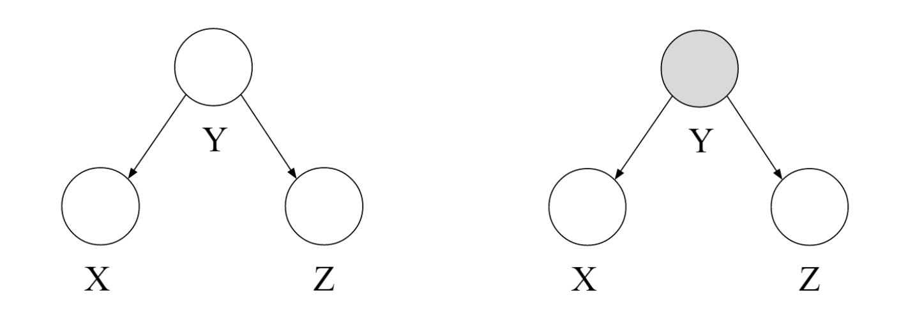
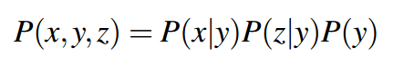
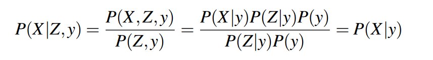
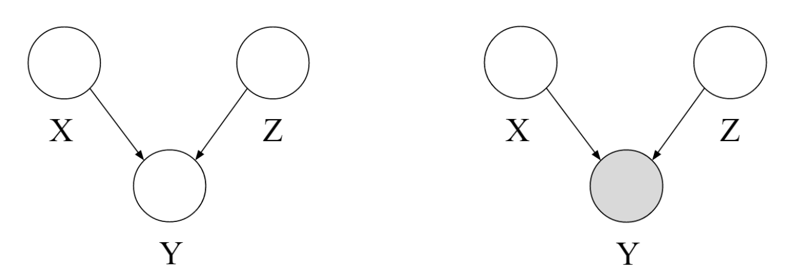
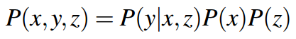
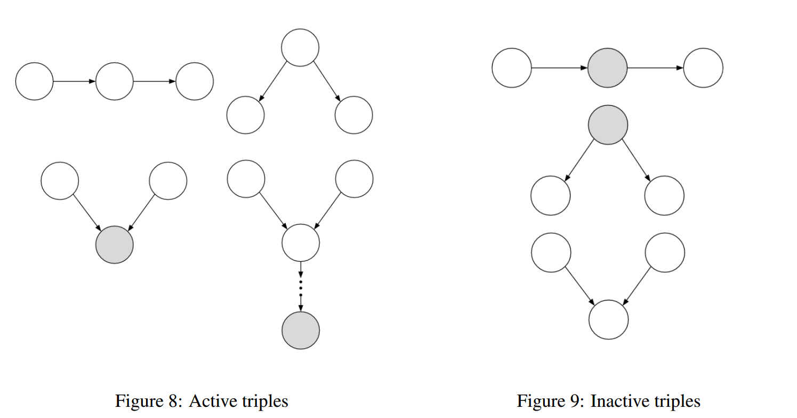

# 条件独立性
## 1 因果链

对于这样一个因果链，x与z**不一定**是相互独立的，例如：
> X：低压Y：雨Z：交通
> **低压导致降雨会导致交通，高压导致无雨不会导致没有交通**

因此x和z并不是相互独立的，但是**在Y已知的条件下**，X和Z是相互独立的。

即

## 2 共同原因

它表示为：

这个也无法保证X独立于Z，也是只能在Y的条件下相互独立；

## 3 共同影响

它表示为：

如果**Y未被检测到(即不建立在Y已知的条件下)**，那么x和z是相互独立的，但是如果**Y被检测到（即建立在Y已知的条件下）**，那么X和Z不是相互独立的。
## 4 D-separate-Algorithm
该算法用来分析两个变量之间是否独立，具体操作如下：
对于变量X和变量Y：
> 1. 遮蔽所有的观测点{Z1,Z2,...,Zk}
> 2. 枚举所有X到Y的**无向路径**。
> 3. 对于每一条路径：
> > a. 将路径分为三元组（每段3个节点）
> > b. 如果三元组都是**active**的，则该路径也是**active**的，并且记作**d连接**。
> 4. 如果X和Y中没有**d连接**，则X和Y就是**d分离**，因此给定{Z1,Z2,...,Zk}，它们是相互独立的。
> 注：**active**元组就是上述讨论的三元组的三种情况中的一种。
> 

