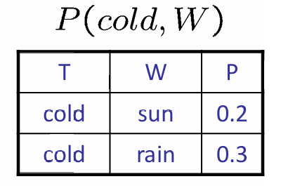

# 贝叶斯网络中的精确推理
## 1 概念详解
### 1.1 联合分布P（X,Y）
- 对于所有x，y的所有的词条P(x,y)
- 总和为1
例如：

### 1.2 选定的联合概率分布P(x,Y)
- 联合分布的**一部分**
- 对于**固定x**,**所有的y**，所有的P(x,y)
- 总和为P(x)
例如：

#### 注：对于1.1和1.2而言：**大写字母的数量即为表的维度**
### 1.3 单个条件P(Y|x)
- 对于**固定x**，**所有的y**，所有的条目P(y|x)
- 总和为1
例如：

### 1.4 家庭条件P(Y|X)
- 多条件
- 对于**所有的x，y**，所有的词条P(y|x)
例如：

### 1.5 指定家庭P(y|X)
- 对于**固定y，所有的x**,所有的词条P(y|x)
- 总和没有规律
例如：

## 2 消除变量
### 2.1 连接
**将两个变量合并成一个联合变量**
加入因素,例如：

多重连接：

### 2.2 消除
采取一个factor并将其进行sum，例如：

多次消除：

### 2.3 提前边缘化
一般我门是先**join**所有可能用到的变量，最后再逐个**消除**，但是提前边缘化可以实现一个一个的**join**，然后再**eliminate**.

### 2.4 结果
当我们选定某个**固定的变量的时候**，我们可以将联合分布表进行一定的修改

## 3 一般变量消除
对于P(Q|E1,E2,...,En):
> 1. 从内在变量开始：
> 2. 如果有隐藏变量的话(不是Q或者Ek（k∈0,1,...,n）)：
> > a. 选中隐藏变量Hi
> > b. join所有提及到隐藏变量Hi的factors
> > c. 消除（sum）Hi
> 3. join所有剩下的factor然后在边缘化

以下是具体的例子：

由于知道联合概率就能知道边界概率（例如：已知P(A,B,C)的联合概率分布表,则可以通过sum操作得到P(A,B),因此P(C|A,B)=P(A,B,C)/P(A,B)来求得
