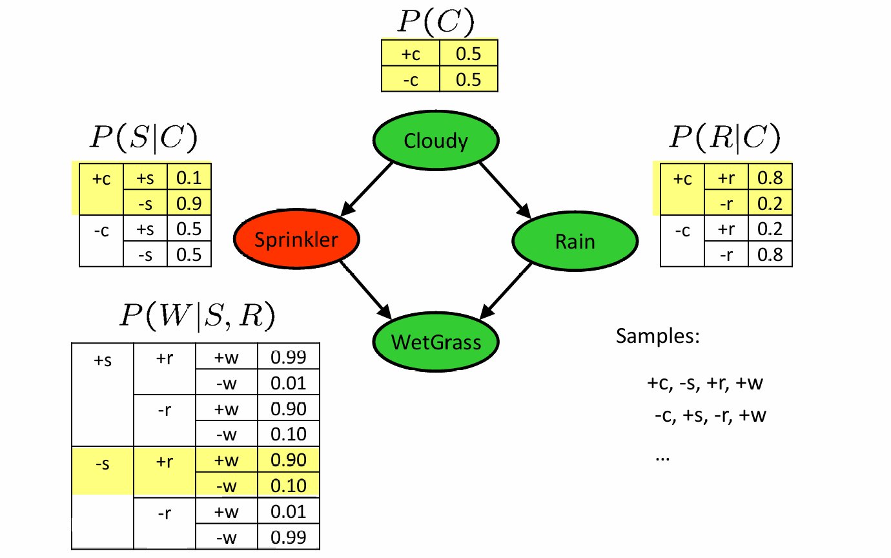
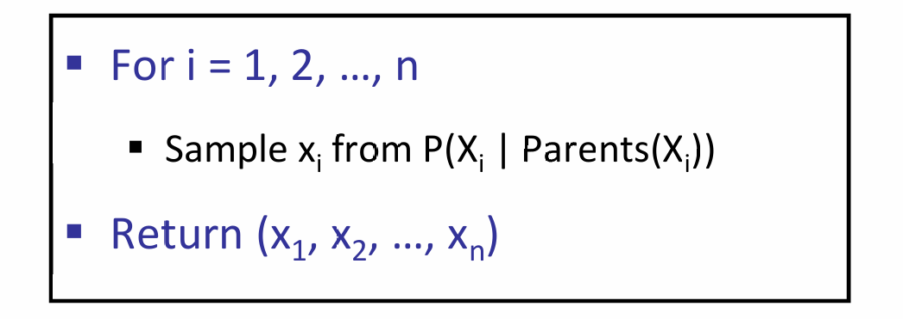
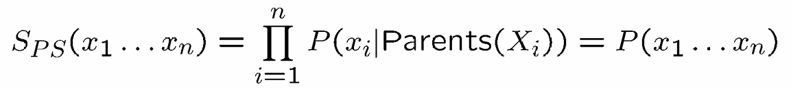
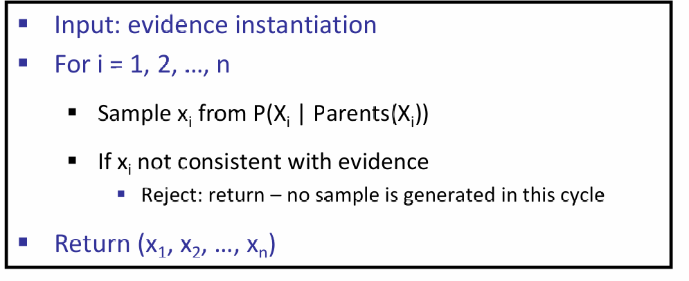
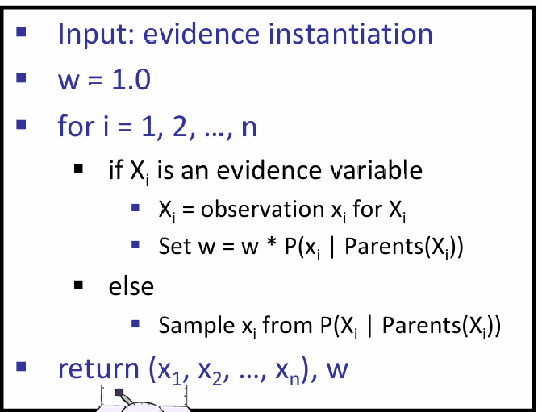
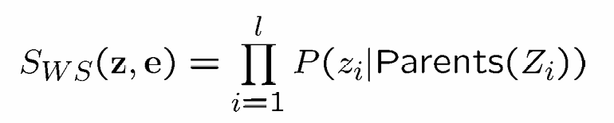
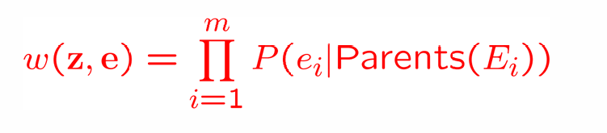
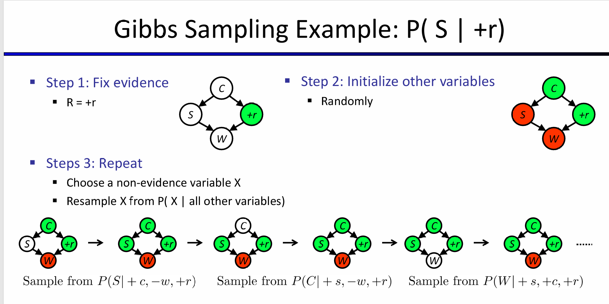
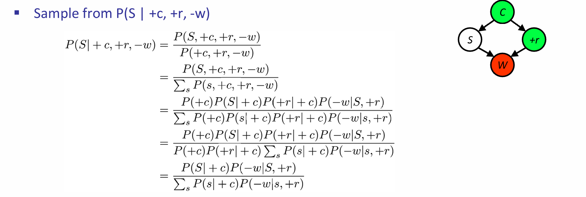
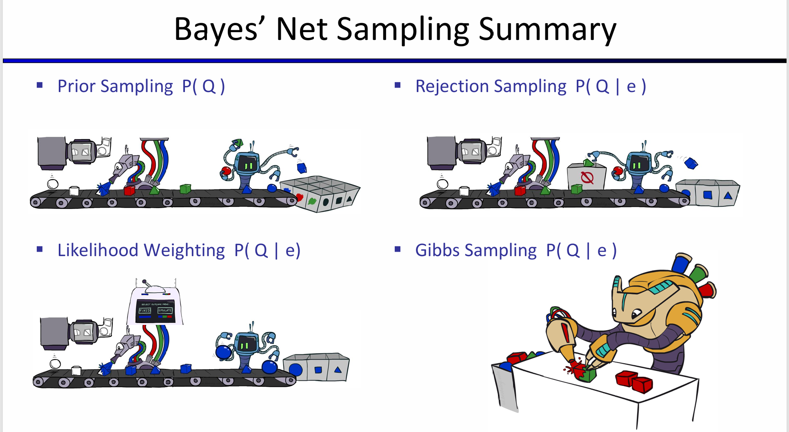

# 贝叶斯网络中的采样（Sample）
## 1 四种采样模式
### 1.1 Prior Sample（优先采样）
首先从单个变量开始，例如下面的例子：

按照拓扑结构来分析即可
它的概率也就是各变量条件概率的乘积，也就是：

这与贝叶斯网络中的联合概率是一致的
### 1.2 Reject Sample（拒绝采样）
当我们看到与给定变量不符合的样本的时候，我们应当舍去（比如我要（A,+b）,则我应当舍去（A,-b））

由于能够提前舍去掉不符合要求的样本，因此速度会提高很多
### 1.3 Likelihood weight（似然加权）
将某一个给定的变量全部都换成唯一的evidence
**这也就意味着：当你遇到一个证据变量的时候，不需要进行采样，而是直接查表来决定如何降低其权重**。

这意味着我们有了一个样本，并且知道他的权重是多少

e为固定变量，此时只需要**将非固定变量的条件概率进行相乘即可**。
权重的计算只有当遇到**证据变量的时候才会发生改变**.

当我们执行通常的计数操作的时候，我们用**wj而不是1来加权样本j**。
### 1.4 Summary
对于上述的三种方法，其中似然加权是计算效率最高的，其原因超出了理解范围之内，因此暂不过多讨论。
## 2 吉布斯采样
首先将**所有变量**设置为一些完全随机的值，然后，我们一次重复选择一个变量，清除它的值，并在给定当前分配给所有其他变量的值的情况下重新采样它。
例子如下：

**许多项都会被消掉，只有包含S的概率**。
**只有包含重新采样的变量的条件概率表才需要考虑并结合起来**。
## 3 总结
在本文中，我们学到了概率推断的两种方法：**精确推断和概率推断（抽样）**

