# VPI
## 1 Utilities
首先我们定义三种情况：
1. 奖品（prize）：是一个固定的选项
2. 彩票（lottery）：表示一种不定的情况，比如彩票L：
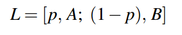
它表示的是以P的概率取A,(1-P)的概率取B
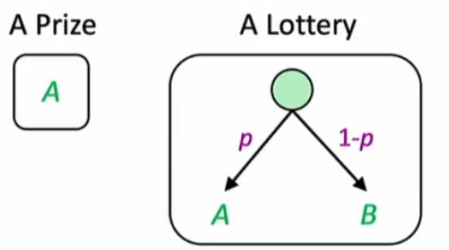

表示：
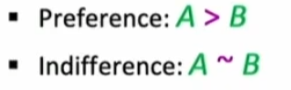
**合理的偏好**：
1. 传递性：
   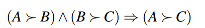
2. 连续性：
   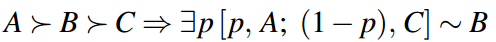
   解释一下就是:假设A为200元现金，B为100元现金，C为0元现金，**当P=1时我会更倾向于选择彩票而不是B（因为此时彩票必定是200元），当P=0的时候，我会更倾向于选B而不是彩票（因为此时彩票只能是0元），当P从1降低至0的时候，总有一个概率P使得对于选择彩票或者选择B是*无所谓的*，**
3. 可替代性：
   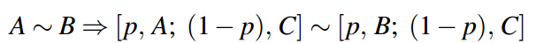
4. 单调性:
   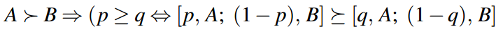
5. 基础性:
   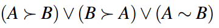

对于分配方面：
- 智能体将为首选奖品分配更大的效用
- 而且彩票的效用是彩票产生的奖品效用的期望值。
  可以用以下两条来概括：
  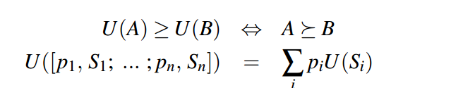
举一个例子：
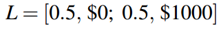
##### 另一个事件为获得500$
分别有三个智能体A1,A2,A3,其中：
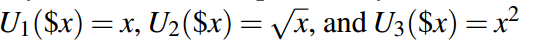
如果每个智能体要么选彩票，要么选500$，则每个智能体的分布如下：
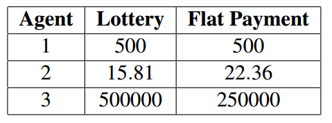
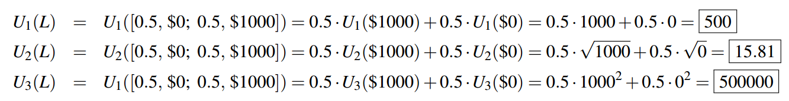

## 2.计算方法：
> **椭圆：机会节点，BN中的节点。
矩形：动作节点，代表一系列的动作。
菱形：利用节点（Utility nodes），是上面两个节点的子节点，表示某一行动下的期望值。**
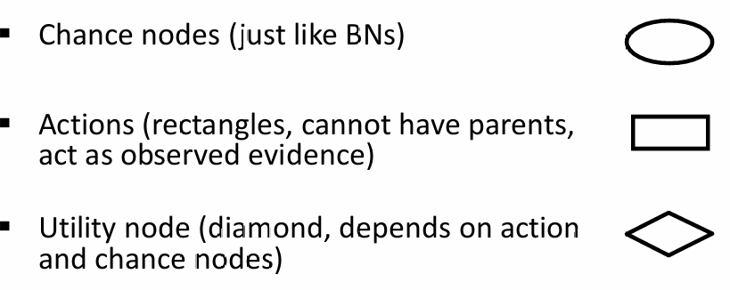
1. 实例化各个已知变量，然后根据**推理**来得到后续变量的条件概率。
2. 计算各节点的期望值，遍历每个可能的行动，并根据前一步计算的后验概率，计算采取该行动的期望效用。在给定证据e和n个机会节点上采取行动的期望效用用以下公式来计算：
   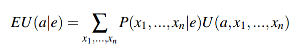
3. 最后挑选最大期望的操作来获得MEU。
   
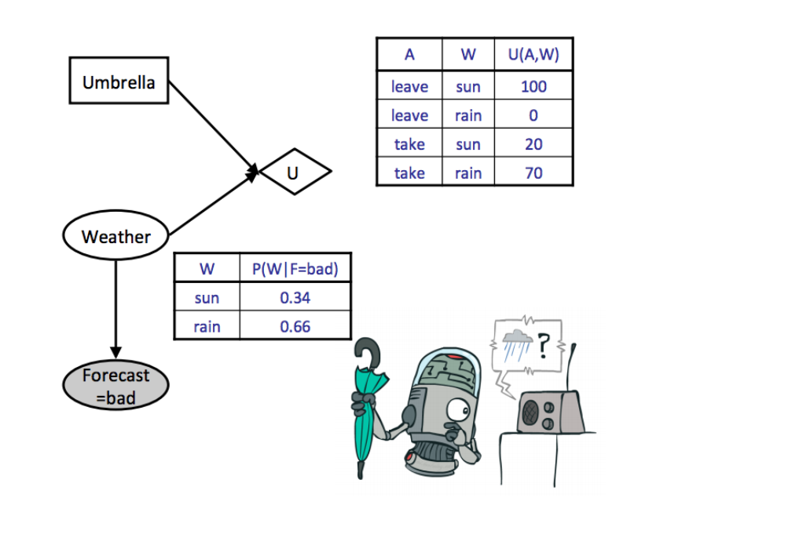
关于折扣因子：
你关心的步长大概是1/(1-折扣因子)，例如折扣因子为0.99，则你关心的步长大概是100步。
## 3.结果树
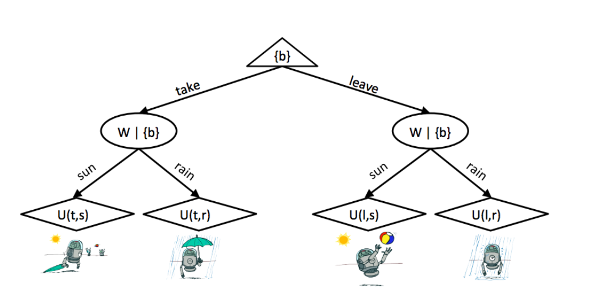
顶部的根节点是一个最大化节点我们选择一个行动，它把我们带到树的下一个层次，由随机节点控制。在这个层次上，机会节点在最终层次上解析到不同的效用节点，其概率对应于在底层贝叶斯网络上运行的概率推断得出的后验概率。
假设我们已经知道**已知变量E=e**，则：
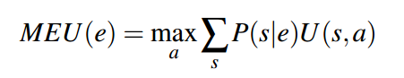
在已经知道**已知变量E=e**的前提下，假设我们已经知道**一个新的evidence E'=e'**，则：
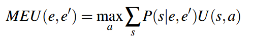
但是，我们不会预先知道我们观测到的变量是什么值（比如上式中的E'），因此我们必须要用随机变量来表示它，例如：
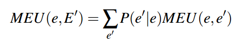
### value of perfect information (VPI)：
我们想要找到当我们选择观察新的证据，我们的MEU预计会增加多少。如果我们选择观察的话，我们知道我们现在的MEU和新MEU的期望值，所以预期的MEU增量就是这两个项的差
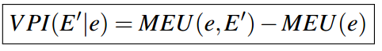
我们可以把
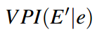
理解在现有证据e的情况下观察到新证据E'的价值
##### 例子如下：
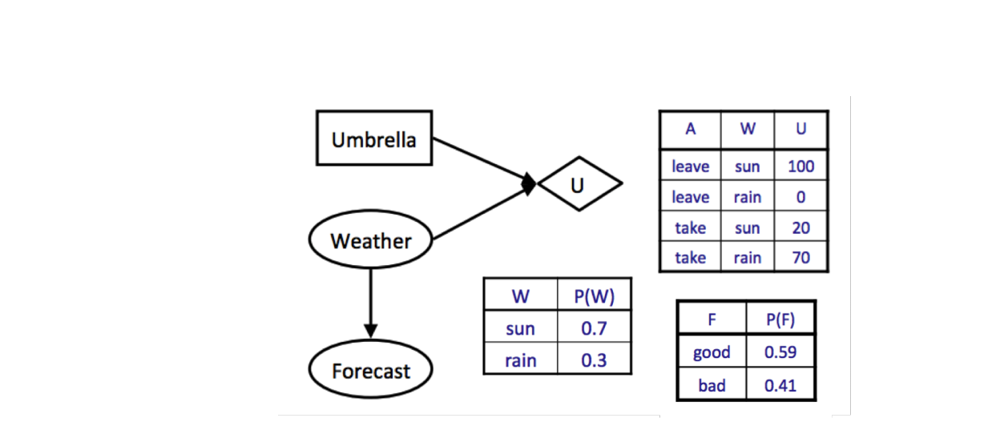
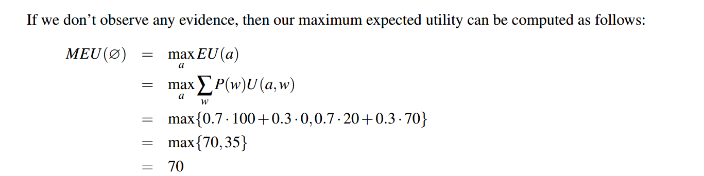
##### 注意，当我们没有证据时，惯例是写MEU(∅)，表示我们的证据是空集。现在假设我们要决定是否要看天气预报（变量用E'表示）。我们已经计算出MEU(F = bad) = 53，让我们假设对F = good进行相同的计算得到MEU(F = good) = 95。现在我们准备计算MEU(e, E')：（~~注：此时的e为空集！！！！！！！！~~）
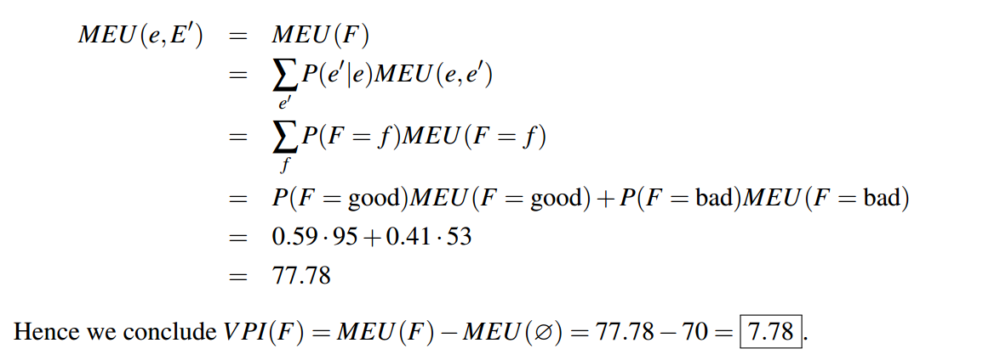
## 4.VPI的性质
- 非负性：观察新的变量总能够让你做出更好的选择，因此你的最大预期只会增加
- 非加性：
  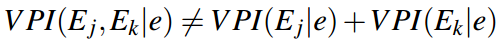
- **顺序独立性：
  我们是一起观察这些新的证据变量，还是以某种任意的顺序观察这些新证据变量，实际上并不重要。**
  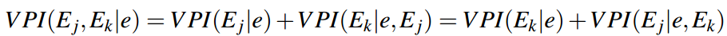