# 马尔可夫模型
## 1 马尔可夫链
如果我们将Wi定义为代表第i天天气的随机变量，那么天气示例的马尔可夫模型将是这样的：
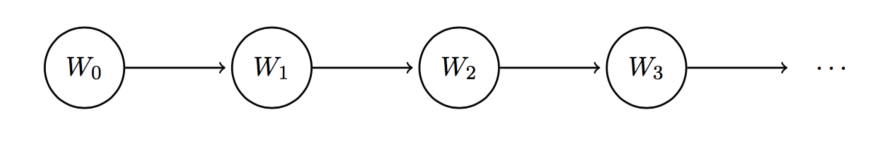
由于马尔可夫链模型中：
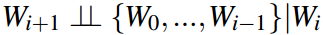
因此，
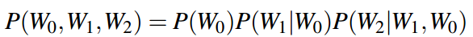
也可以简化为：
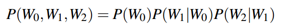
这样，我们得到了一个通式：
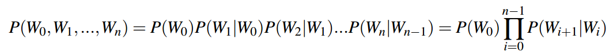
因此在马尔可夫链中我们仅需要存储P(W0)和P（Wi+1|Wi）即可，即：
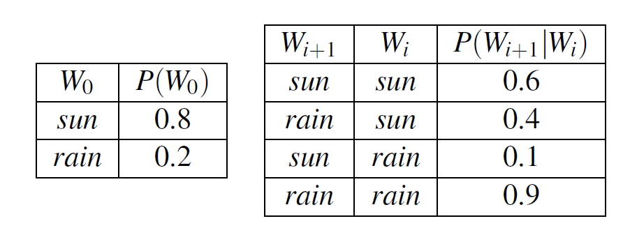
## 2 迷你的前向算法
比如我想要知道第i+1天的天气，那么可以用：
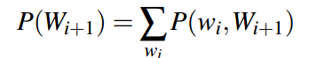
同时，我们可以将该式子从第i天的条件分布开始计算：
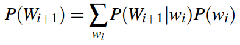
**为了计算时间步长i+1的天气分布，我们查看时间步长i由P（Wi）给出的概率分布，并使用我们的过渡模型P（Wi+1|Wi）将该模型“推进”到时间步长。**
## 3 平稳概率分布（也称收敛概率分布）
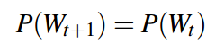
上述式子也是我们达到收敛时的条件，通过马尔可夫链进行变形，可得：
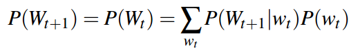
对于我们天气的例子而言：
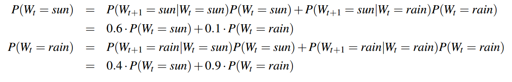
其中还有一个条件（**同一变量的所有可能发生的事件的概率和为1**）为：
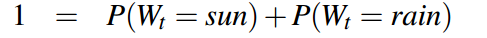
解得：
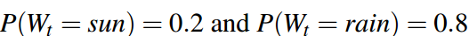
因此，稳定概率分布为：
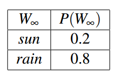
## 4 隐马尔可夫模型
它允许我们在每个时间步观察一些**证据**，这些证据可能会影响每个状态下的**分布**。
与普通的马尔可夫模型不同，我们现在有两种不同类型的节点。为了进行区分，**我们将每个Wi称为状态变量(state varible)，将每个天气预报Fi称为证据变量(evidence varible)**。
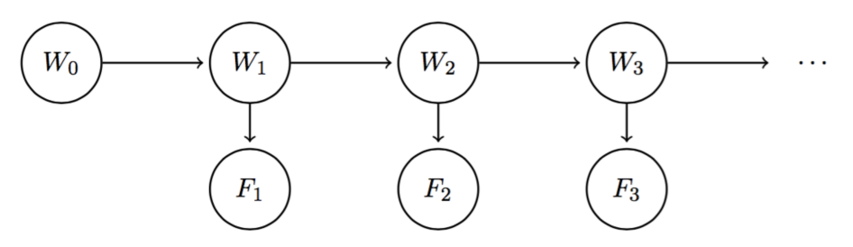
并且有以下关系（可以参考之前的Bayes Network中的三种基本独立模型）：
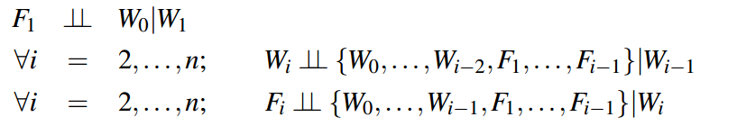
在隐马尔可夫模型中，我们是假设**过度模型（P（Wi+1|Wi））** 是平稳的。并且**传感模型（P（Fi|Wi））** 也是平稳的。
定义 **信念分布（belief distribution）** 为：
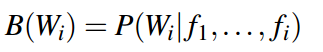
同时定义：
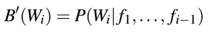
定义**ei为在时间步长为i时观测到的证据变量**，时间步长1≤i≤t的聚合证据重新表示为以下形式：
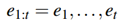
在这个符号下：
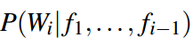
可以写作：
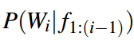
对于上述式子，我们可以进行一定程度的延伸：
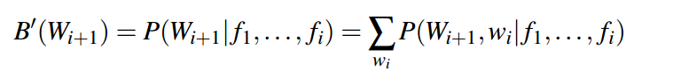
上式可以表示为：
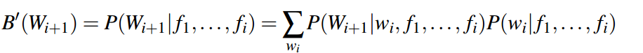
注意到：
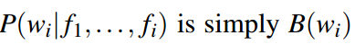
并且：
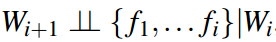
因此最终可以化简为：
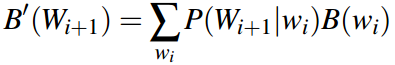
对于B(Wi+1)，有：
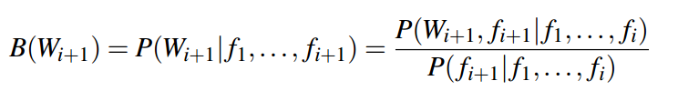
变形后可得：
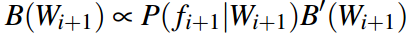
因此，**前向算法为：**
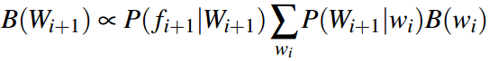
### 4.1 summary
公式1：

公式2：

这两个公式分别对应了：
**时间推移更新对应于从B（Wi）确定B'（Wi+1）和观测更新对应于从B’（Wi+1）确定B（Wi+1）。**
对此，考虑以下**初等模型、过渡模型和传感模型**：
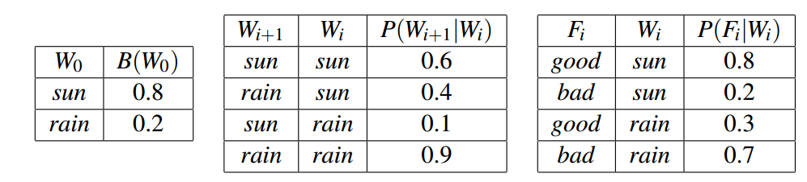
为了计算B(W1),我们需要先计算B'(W1),则：
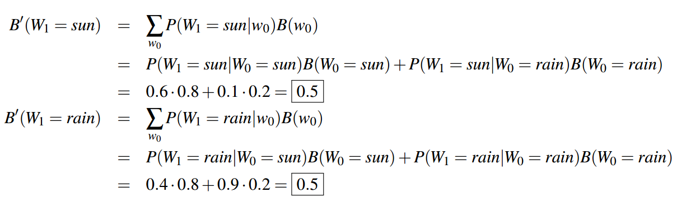
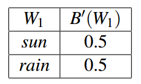
接下来，我们假设第一天的天气预报很好（即F1 =好），并执行观测更新以获得B(W1)：
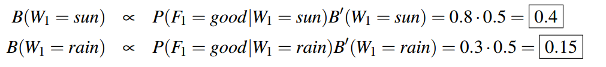
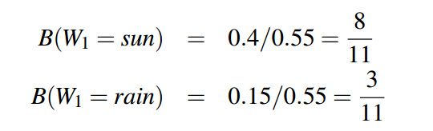
因此，我们最终的表为（**表中的B'(W1)应该为B(W1)**）：
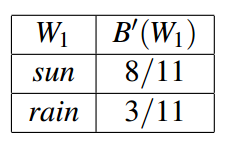
具体思路总结为：
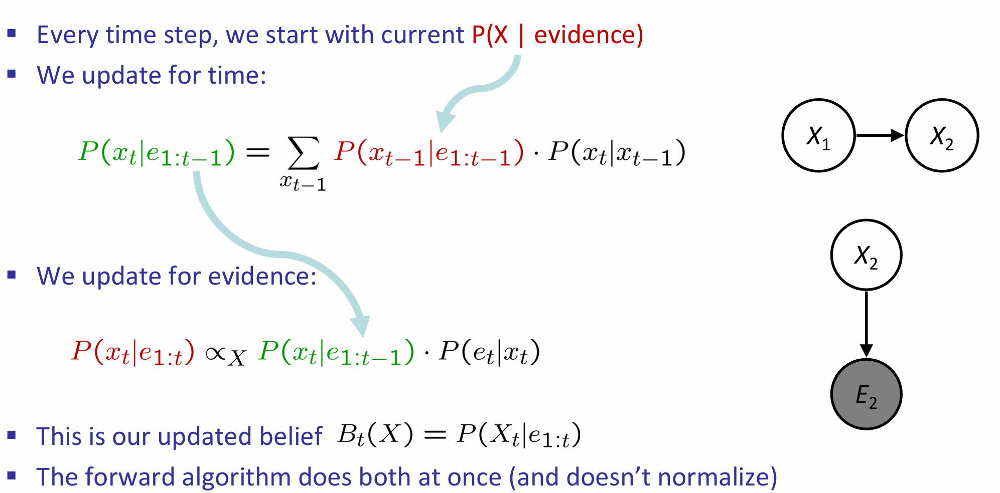
## 5 Viterbi算法
Q:给定到目前为止观察到的证据变量，系统遵循的最可能的隐藏状态序列是什么？
即求解：argmaxx1:NP(x1:N|e1:N) = argmaxx1:NP（x1:N, e1:N）
在Viterbi算法中，我们希望求得：
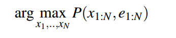
举个例子，在以下给定的状态模型中：
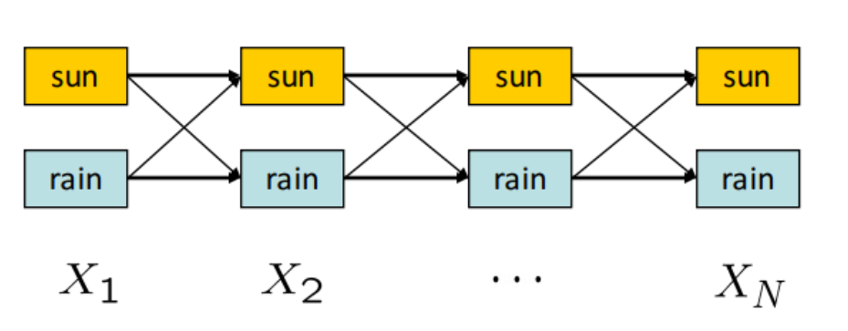
在这个有两种可能的隐藏状态（太阳或雨）的HMM中，我们想要计算从X1到XN的最高概率路径（每个时间步长分配一个状态）。
**从Xt-1到Xt的边权值等于P(Xt|Xt-1)P(Et|Xt)**
权重公式中的第一项表示特定转变的可能性，第二项表示观察到的证据与结果状态的匹配程度。
对于概率论密度，有：
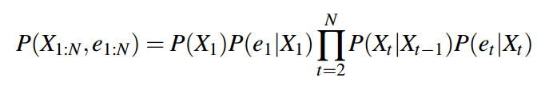
根据前向算法，可得：
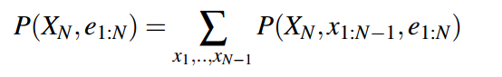