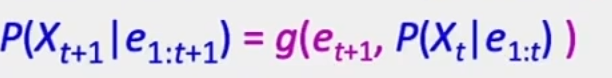
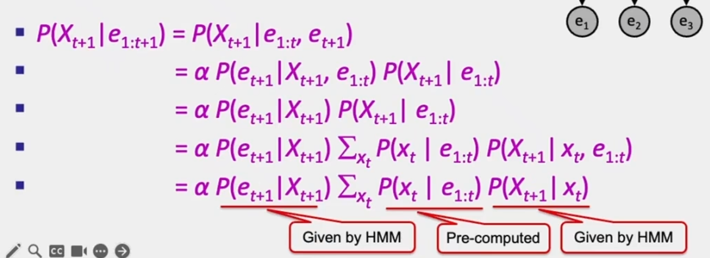
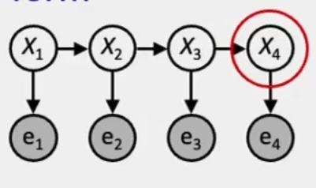
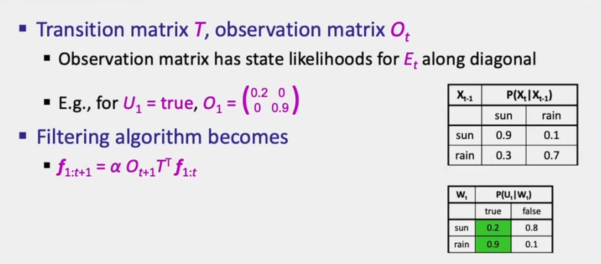
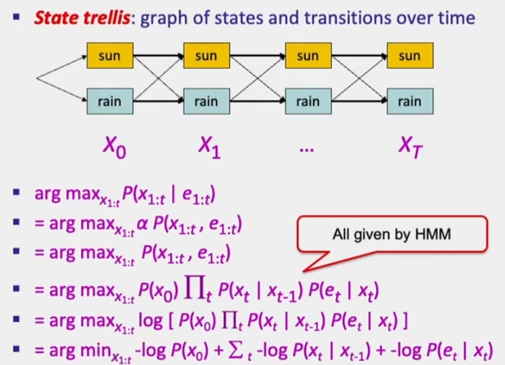
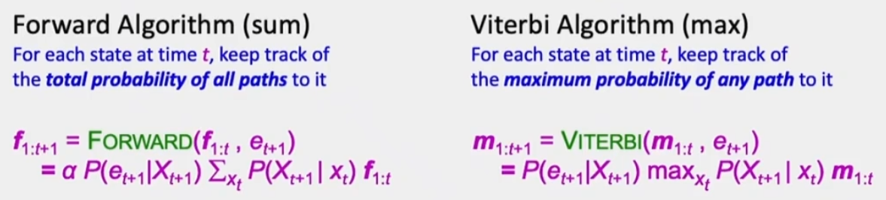
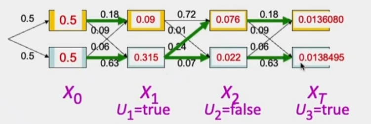

# 粒子滤波
## 1 回顾前向算法
**目标：设计一种递归的滤波算法：**

**上述式子中：前半部分为Update部分，后半部分（求和部分）为Predict部分**
对于下列HMM而言：

**如果知道X4，那么没有任何消息能够帮助我更好的去预测e4**

线性代数中的算法：

求最大可能路径（也就是上一节课中提到的那个算法）：

将求最大路径转换成求最小路径问题 
对于前向算法，我们需要跟踪所有的路径，而对于Viterbi算法，我们只需要跟踪最大可能的路径。

该算法的示意图如下：

## 2 粒子滤波
粒子：也就是样本的另一种称呼而已
我们不是存储一个完整的概率表，而是存储一个n粒子的列表。