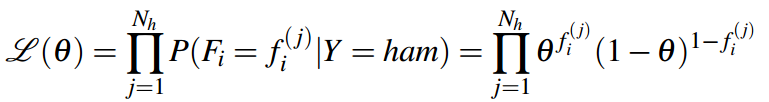

# 机器学习
## 1 概念：
机器学习过程通常会将数据集分成三个不同的子集：
1. 训练数据集：用于生成一个模型，它可以用来将输入映射到输出。
2. **验证数据集：用于通过对输入的检测来预测并生成准确度来衡量模型的性能。**
3. 测试数据集：使用该模型对数据子集进行预测，用于衡量数据的性能。

## 2 几种机器学习的算法（naive bayes、perceptrons、logic regression、neutral network）：
### 2.1 朴素贝叶斯（naive bayes）
我们的目标是使用这些训练数据，来学习某种关系，如何构建一种用于解决分类问题的模型，称为朴素贝叶斯分类器
从数据集中提取**特征**，决定使用哪些**特征**也称为特征工程，也是激起学习的基础f(x)为特征函数。
通过已知特征的前提下，我们可以得到对应的概率：

例如：

给定Y，每个Fi都有条件独立于所有其他Fi。
如果用bayes网络来表示的话，（假设Fi有0或1两种情况，Y也有两种情况）P(Fi|Y)总共有4种可能，而总共有N个特征，因此是4n，再加上P(Y)的两个条目，总共是4n+2，为线性存储空间。

由于

与

成比例，因此我们可以计算：

#### 2.1.2 参数估计
首先回顾似然函数：
**在已知结果的情况下，该事件在不同条件下发生的可能性**，也就是从结果推测条件（这正好符合我们对于机器学习的认知：**通过给定的数据来推测出具体的模型**）
最大似然估计通常做以下简化假设：·每个样本都来自相同的分布，换句话说，每个xi都是同分布的。
对于似然函数L(θ)：
1. 对于固定样本X1,X2,...,Xn，**似然函数只是θ的函数**
   
2. 若样本是独立同分布，则：
   
我们怎样才能找到使这个函数最大化的θ值呢？这将是最好地解释我们看到的数据的θ值。回想微积分，在函数的最大值和最小值实现的点处，它相对于每个输入的一阶导数（也称为函数的梯度）必须等于零。因此，θ的最大似然估计值是满足以下等式的值：

 以下是一个例子：
 > 假设你有一个装满红色和蓝色球的袋子，不知道每种球有多少个。你从袋子里拿出一个球，注意颜色，然后把球放回去（替换取样）。从这个袋子里抽出三个球的样品，得到红色，红色，蓝色。这似乎意味着我们应该推断袋子里有2/3个球是红色的，1/3个球是蓝色的。**我们假设每个从袋子里拿出来的球都是红色的概率为θ，蓝色的概率为1-θ，对于我们想要估计的某个值θ（这被称为伯努利分布）**：
 
 我们的样本的可能性是：
 
 最后一步是将似然的导数设置为0并求解θ：
 

 > 现如下再举一个例子：
 让我们回到为垃圾邮件分类器推断条件概率表的问题：
 > - n：我们词典中的数量
 > - N：数据集的数量，**Nh为ham（正常邮件）的数量，Ns为spam（垃圾邮件）的数量**，Ns+Nh=N
 > - Fi: 一个随机变量，如果第i个字典单词出现在正在考虑的电子邮件中，则为1，否则为0。
 > - Y：一个随机变量，是垃圾邮件还是火腿，取决于相应电子邮件的标签。
 > - fi(j)：这引用了训练集中第j个项目中随机变量Fi的解析值。换句话说，如果单词i出现在所考虑的第j封电子邮件中，则每个fi(j)为1，否则为0。

> 让我们考虑P（Fi| Y = ham），则：
> 
> 则公式推导如下：
> 
> 
> 

#### 2.2 Smoothing

虽然最大似然估计是一种非常强大的参数估计方法，但糟糕的训练数据往往会导致不幸的后果。使用朴素贝叶斯分类器的过拟合可以通过拉普拉斯平滑来减轻。强度为k的拉普拉斯平滑假设每个结果都有k个额外的结果。
以下式子表明了**最大似然估计**的另外一种计算方法：

则强度为K的拉普拉斯估计为：

**比如：该案例中每个实例均有两种可能：{收到正常邮件，收到垃圾邮件}，则|x|=2**
扩展该式，可得：

> 对于拉普拉斯平滑而言：
> - 当k=0时，拉普拉斯平滑就退化成了最大似然估计。
> - 当k=∞时，观察每个结果的数量非常大，无限大，使得实际样本的结果无关紧要，因此您的拉普拉斯估计值意味着每个结果的可能性相等。：
> > 