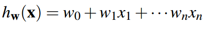
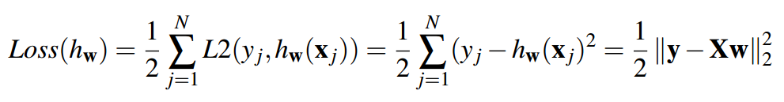
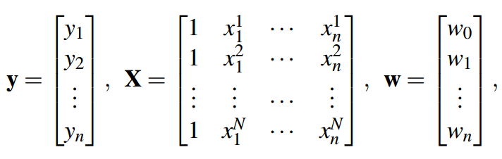
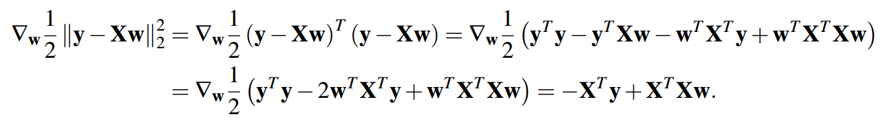

# 线性回归
## 1 概念
对于x的n个特征而言，我们记为一组向量：
X=(x1，x2,...,xn)
我们可以用以下线性模型来预测输出：

**其中线性模型中的wi是我们想要估计的**，w0对应与模型的差距。
但是我们此时的X可以写作X=(1,x1，x2,...,xn)
**这样能够更契合我们的权重模型w=(w0,w1,...,wn)**
### 1.1 损失函数
为了训练模型，我们需要一个衡量我们的模型预测输出的指标。为此，我们将使用L2损失函数，该函数使用L2范数惩罚预测结果与实际输出的差异。如果我们的训练数据集具有N个数据点，则损失函数定义如下：

> 对于上述式子而言：
> 1. xj表示X数据集中第j个样本的特征向量
> 2. yj表示第j条样本的真实标签（目标值）
> 3. 
> > 
> 4. 

对于最右端的式子，解释如下：

**其中y是堆叠输出的向量，X是特征向量的矩阵，其中xji表示第j个数据点的第i个分量。现在可以使用基本线性代数规则导出用w表示的最小二乘解。更具体地说，我们将通过微分损失函数并将导数设置为零来找到使损失函数最小化的w。**

当梯度为0的时候，即：

获得估计的权重向量后，我们现在可以对新的未见过的测试数据点进行预测，如下所示：

补充：
> 梯度用于寻找损失函数的极小值，而不是损失函数的绝对大小。
梯度为 0 仅表示局部平稳状态，不一定是最大值。
最大值的位置通常在梯度为 0 且二阶导数为负的点。

## 2 线性分类（感知器）
### 2.1 概念：
线性分类的思想就是：当我们有一些**特征样本**的时候，通过初始化**权重w**，将该权重与每个样本的特征相乘：

得到的值若为正的，则记作1，若为负的，则记为-1，并且与**实际的目标值**进行对比，若hw(x)预测合理，则不用改变权重；若预测不合理，则需要改变样本权值。当样本全部都分类完毕的时候，就确定好了权重W。

### 2.2 几何角度
为了从几何上理解这一点，让我们重新审视向量化的激活函数。我们可以将点积改写为如下，其中θ是幅度算子，θ是w和f（x）之间的角度：

因此我们应该关注cosθ的符号：做一个垂直于w的法向量，若θ大于90°，则为负，否则为正

**这条法线也被称为决策边界线**
### 2.3 算法
> 1. 初始化所有权重为0：w=0
> 2. 对于所有的训练样本，特征为f(x)=(x1,x2,..,xn)，并且**y* 为样本的真实值，y* ∈{-1，1}**
> > 3. 分类各个样本
> > 
> > 4. 进行判断：
> > a. 如果y=y*（即预测正确，那么就不做任何事情）
> > b. 否则就是预测不正确，那么需要更新一下权重w：**w ← w+y*f(x)**
> 5. 如果遍历了所有样本，则返回权重值。