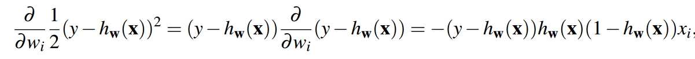

# 逻辑回归
## 1 概念
逻辑回归用于解决分类问题，而不是回归问题。
不同于 上一篇中的回归函数，在这里：

图形如下：

我们将得到的逻辑函数输出值进行一个定义：

即输出值大于0.5的话，归结到标签1
若输出值小于0.5的话，归结到-1.
### 1.1 相关公式推导：
对于损失函数：

补充一条结论：
**对于逻辑函数，有：**

则对损失函数梯度进行计算，可得：

## 2 多类逻辑回归
如果想要将数据分为多个类别而不是两个类别，那么我们需要**构建一个新的模型，** 这里使用softmax函数代替原来的逻辑函数：

注：此时的i代表对于一个事件有k种情况，这里取的是第i种情况！

这个式子表示的就是对于k种情况，取第i种情况的概率。

因此给出最大似然估计

注：该式种的i表示对于n个样本而言，取其中第i个样本进行观测。

另外的，我们可以引入ti,k，意味着当yi=k的时候，ti,k=1，否则就取0，于是有如下式子：

其中

也说明了yi只有在某一种特定的情况的时候，才会取得（对于多个样本，有不同的情况）
取对数，得：

求解其梯度，得：

其中：

（因为对于yi而言，k种情况中，只能出现一种情况）
