# Neural Networks
## 1.梯度
### 1.1.梯度上升法：
如果想要最大化函数，则使用梯度上升法：
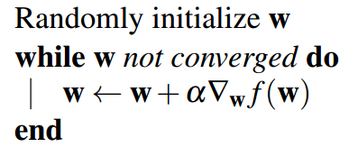
### 1.2.梯度下降法：
如果目标是我们试图最小化的损失函数，则使用梯度下降：
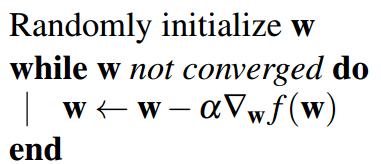
我们用α表示学习率，它捕获我们向梯度方向迈出的步伐的大小。实际上，我们需要一个足够大的学习率，这样我们就可以快速地朝着正确的方向前进，但同时又足够小，这样方法就不会发散。**通常一开始学习率取得比较大的数值，同时随着迭代次数的增加，学习率逐渐降低。**
## 2.更新迭代权重w
通过上面我们可以知道：对于一个n个数据集而言，我们可以不断迭代w，使得w变为最佳权重
**但是对于n个数据集而言，其数据量较大，因此会导致计算过于繁琐**
因此出现随即迭代和批量梯度下降。
### 2.1.随机梯度下降
在算法的每次迭代中，我们只使用一个数据点来计算梯度，由于数据变得很少，因此收敛会变得十分困难。
### 2.2.批量梯度下降
在随机梯度下降的基础上，进行m个数据大小的数据集来计算梯度（在机器学习中，也就是对应的batch-size的大小）
举例说明:
> 对于最经典的损失函数：
> > 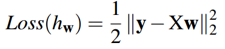
> 
>而言，其梯度为：
> > 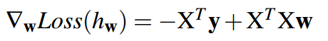
>
> 此时用我们的梯度算法：
> > 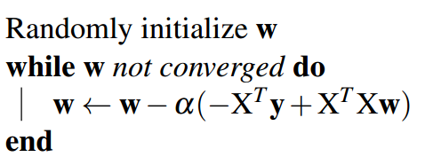
## 3.神经网络
 让我们分析一组神经网络：
 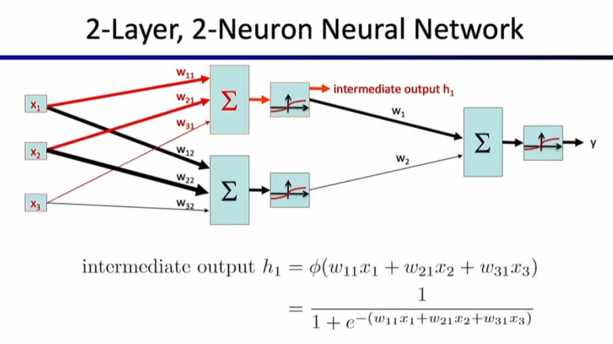
 第一层输出的h1就是我们的一个中间的激活函数，还是用原来的公式计算（此时的结果变成了下一层的输入）
 该激活函数h1计算的值为隐藏层中第一种情况发生的概率，然后可以用这种概率再去与其他的权重进行计算，得到最终层中最终情况的概率。
 因此最终层的神经网络是这样的：
 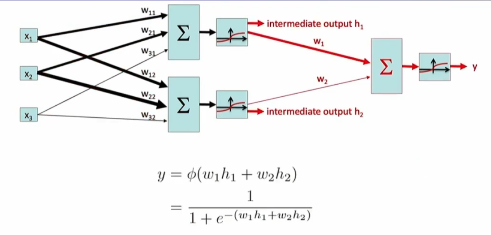
 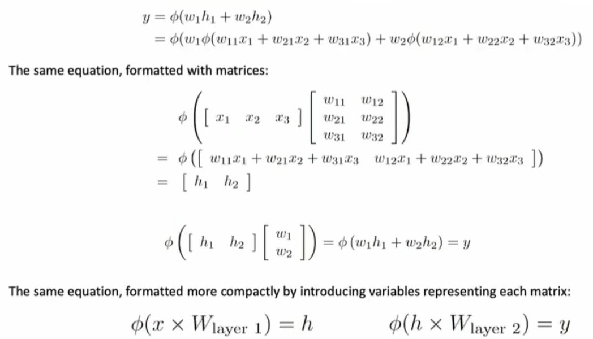
 对于多类逻辑回归而言，其输出可能不止一个：
 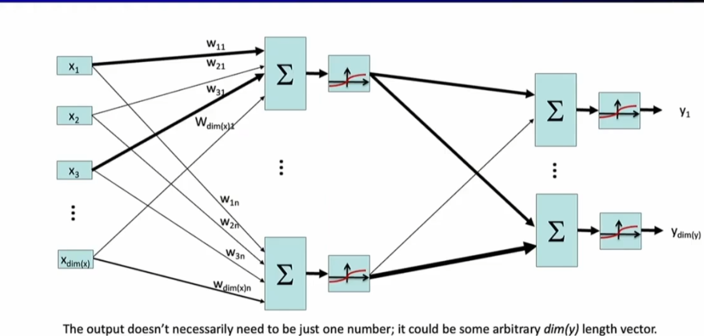
 yi表示y取到第i种情况的概率，比如Y=[student，policeMan，staff，oldMan]
 那么在某一个数据输入的情况下，y可能表示为[0.2，0.3，0.1，0.4]
 概括如下（建议配合自己画图重新理解一遍）：
 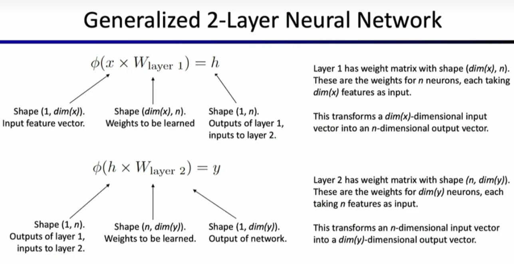
 对于三层的网络而言：
 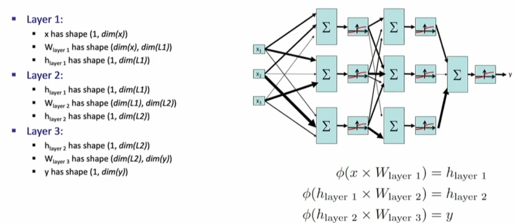
 对于多层的神经网络而言：
 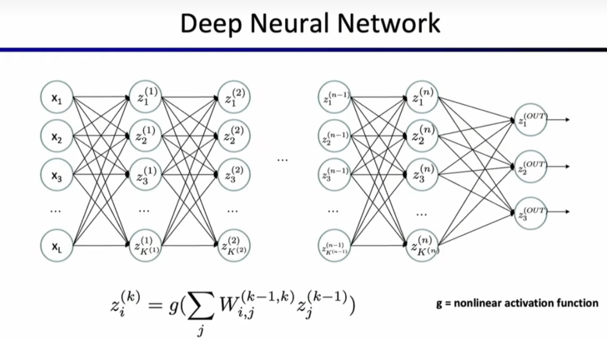
 对于上述中函数g（激活函数），通常有几种常见的激活函数：
 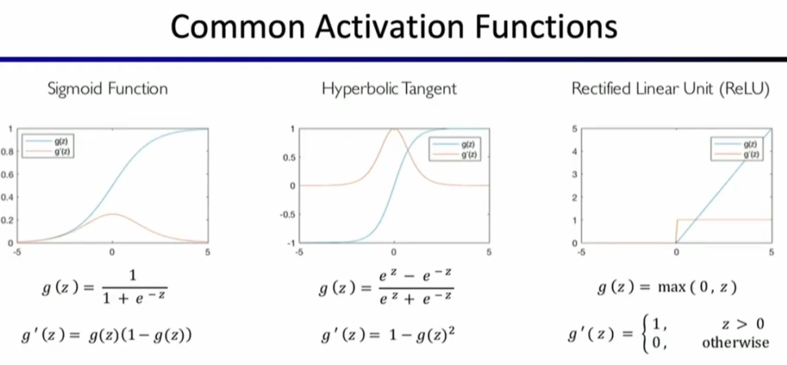
 