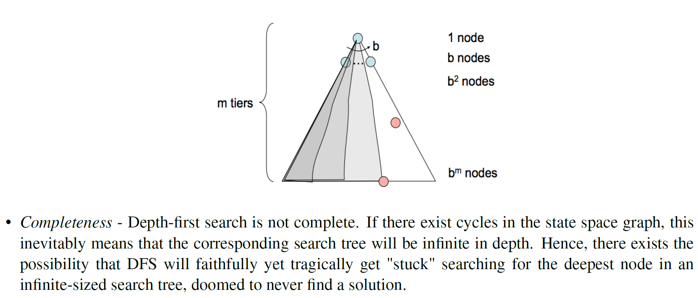
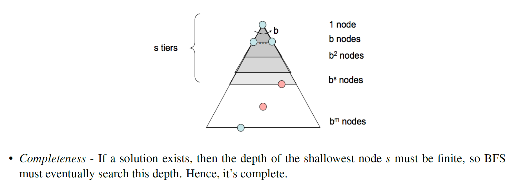
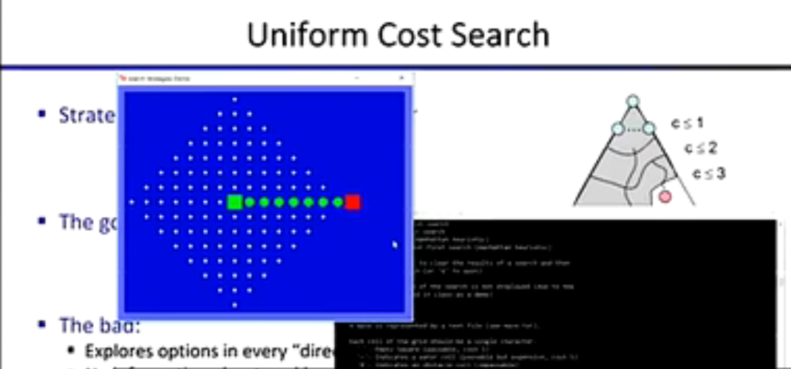
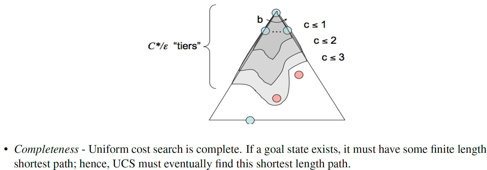
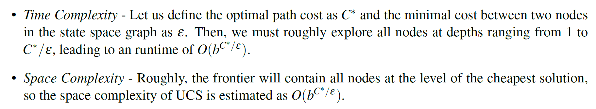

# 状态空间和搜索问题
## 1.搜索问题（包含以下元素）：
- 一个状态空间（能够表示所有状态的集合）。
- 对于每一个状态可能发生的**行动**集合。
- 一个转换模型（输出下一个状态）
- 行动花费（移动到下一个状态时所产生的）。
- 开始状态。
- 目标判断（一个函数，用来判断输入的状态是否为目标的最终状态）。
## 2.对于无穷树的表达方式：
- 在有限的内存空间当中，我们仅仅用来存储我们立即所用到的状态，并且计算下一状态所需求的。
- 对于树，我们仅仅用来存储其节点进行抽象化。
## 3. 对于树的搜索：
- 我们可以用某个**数据结构** 来存放我们的数据（例如栈Stack、堆heap、队列PriorityQueue等）
- 在该**数据结构**中存入我们此时所遍历的**节点**，并且判断该节点是否为所要搜寻的目标节点，如果是，返回该节点
## 4.树的三种搜索方式：
- DFS：使用的是**后入先出**的数据结构，即stack，但是对于味无穷树而言，可能会存在无限循环的情况，且其时间复杂度和空间复杂度均为**O(bm)**。

- BFS:对于广度搜索树方式而言，使用的是**先入先出**的数据结构，即Queue，对于最优搜索方式而言，它通常不是最优的，且其复杂度为**O(bs)**。

- UCS(Uniform Cost Search):数据结构使用的是**heap**，思想为**dijkstra算法**，在二维空间中呈现的是一种**向四周散开**的扩散方式，例如：
  
 
- 其时间复杂度和空间复杂度均为**O(bC*/ε）**。
  

- 对于其时间复杂度和空间复杂度进行补充：
  

