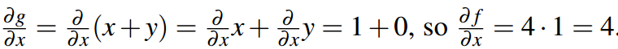

# 神经网络
## 1.非线性分离器：
考虑以下数据：
  
我们想要分离这两种颜色，显然这在一维中是不可能实现的（一维决策边界是一个点，将轴分成两个区域）。
为了解决这个问题，我们可以添加额外的（潜在的非线性）特征来构建决策边界。考虑同样的数据集中添加x2**作为特征**：

这样的话就可以分离这些点了

学习这些特征化或转换函数，也许使用能够表示更广泛函数的非线性函数类。
## 2.多层感知器
### 2.1 定理
**具有足够数量神经元的两层神经网络可以以任何期望的精度逼近任何连续函数**
### 2.2 测量精度
n次预测后，二进制感知器的准确度可以表示为：

## 3.多层前馈神经网络
要使得神经网络呈现出非线性状态，**则我们一般是通过激活函数引入**

### 3.1 带动量的梯度上升

> 补充：在神经网络中，若我们需要批处理的话，对于损失函数而言（由于损失函数是单样本的），因此对于批处理的多样本损失函数我们采用平均值来计算：
> 
> 
### 3.2 最大似然估计的梯度上升法

> 用最大似然估计函数作为损失函数是因为：
> - 似然函数是用来估计在已知条件下，估测样本的可能的概率，其值为[0,1]，其中越偏向于1表示估计越准确 
> - 取负对数，则：
> > 
>
> - 可以发现：此时似然估计的取值范围为[0,+∞),越接近0表示估计越准确，则此时可以作为损失函数。
> 
> **注：损失函数意味着估计值与预测值的偏差。**
> 
> 扩展：以下是各个不同损失函数的对比：

## 4.神经网络的反向传播
我们在反向传播过程中的目标是确定输出相对于每个输入的梯度。
下图就是一个很简答的例子：

其中g(x,y)=x+y,f(g,z)=g*z
计算方法如下：
> 在这个例子中，我们从后往前算，先算输出层到前一个隐藏层的梯度：
> > 该例子中为f对g的偏导以及f对z的偏导。其中：
> > 
> > 
> 
> 然后再计算输出层到上上一层隐藏层的偏导，利用链式法则：
> 
> > 在这个例子中：
> 
> 
> 我们可以通过上一级隐藏层来计算上上一级隐藏层的偏导：
> 
> 