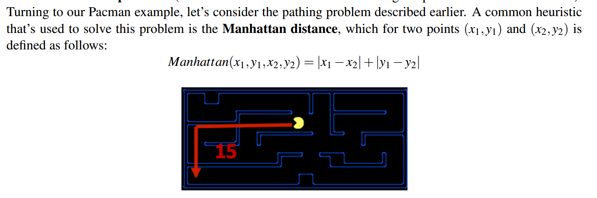
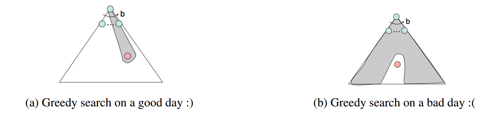
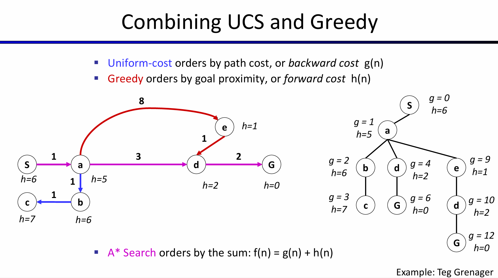
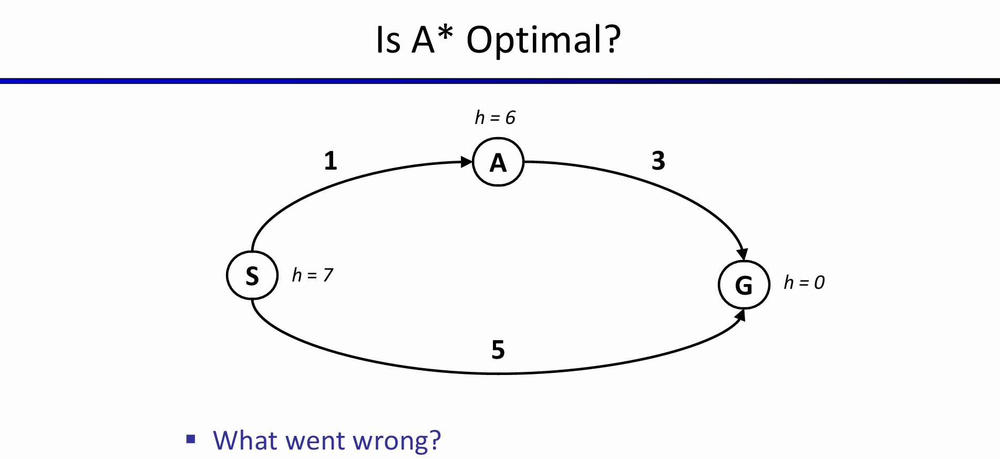
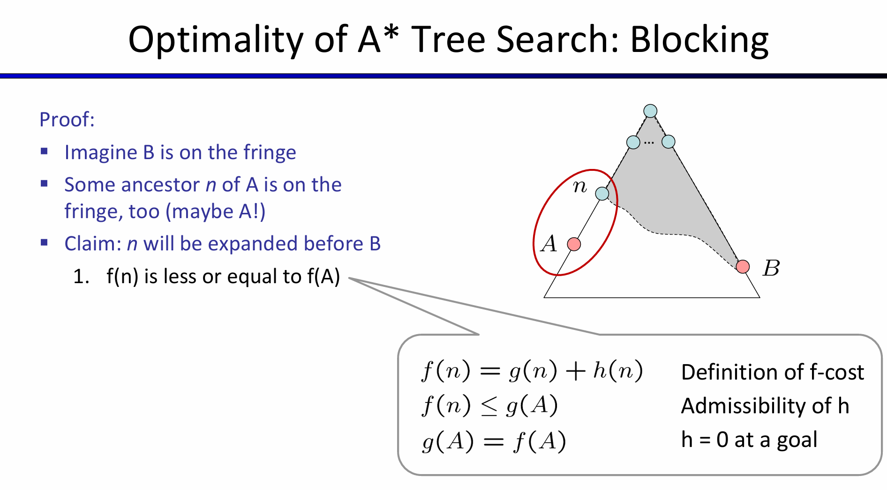
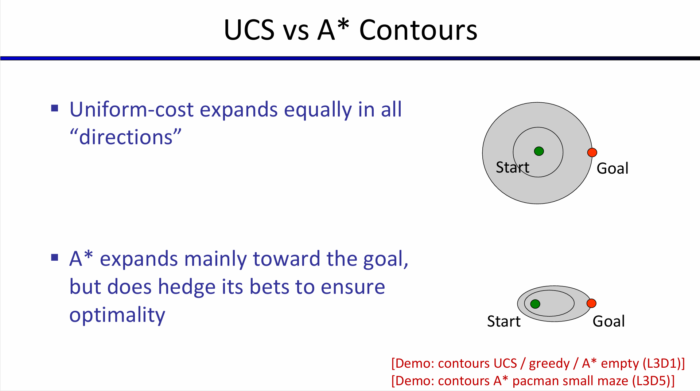
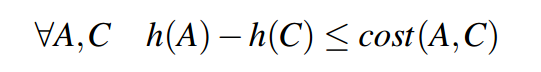
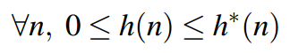
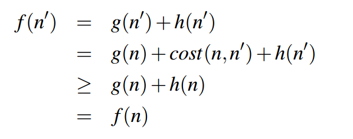

# A* Search and Heuristics
## 1.关于informed Search（知情搜索）：  
> - Heuristics  
> - Greedy Search  
> - A* Search  
### 1.1 Heuristics(启发式   ):  
用来解决松弛问题（原问题中的一些约束条件已被移除），例如吃豆人中，Heuristics就是用来解决当去掉墙壁等约束条件之后的问题：

这个距离就是**松弛问题**中的目标距离，对应的是**实际搜索问题**中估计的目标距离。
这种搜索方式的好处就在于：当决定某个行动（action）的时候，能够通过估计更接近目标状态的期望状态来做出行动。
### 1.2 Greedy Search(贪婪搜索)：
其核心思想就是：在每一步选择**当前状态下最优的动作或决策**，而**不考虑**未来可能产生的后果。
完备性和最优性——贪婪搜索不能保证找到目标状态，也不是最优的，特别是在选择了一个非常糟糕的启发式函数的情况下。它通常在不同的场景中表现得相当不可预测，可以直接进入目标状态，也可以像一个没有得到良好引导的DFS那样探索所有错误的领域。
>比如对于一个路径搜索，此时在A处，有B、C、D三种路径可供选择，贪婪搜索就是分别对于B、C、D三种状态节点处到目标状态处的曼哈顿距离进行分析，选出曼哈顿距离最近的节点进行前进，依次执行该步骤直到找到目标节点或者无解。

### 1.3 A* Search:
#### 1.3.1 A * 的思想：
其核心思想就是找到全局最优解。A*将UCS使用的总后向代价（到达状态路径上的边权之和）与贪婪搜索使用的估计前向代价（启发式值）相加，有效地产生从起点到目标的估计总代价。
**A*****搜索既是完整的也是最优的，结合了贪婪搜索的高速性和UCS的最优性**。  
A *搜索的例子：

图中g表示的是总的后向代价，h表示的是总的向前代价。  
#### 1.3.2 关于A*的一些说明：
1.A*并不一定是最优解，例如下图：

## 2.搜索问题的定理：
对于给定的搜索问题，如果启发式函数h满足可容许性约束，则对该搜索问题使用带h的a *树搜索将产生最优解。

## 3.与UCS比较：

> 对于一致性约束，可以表达为：
> >   

>对于可容许性，可用数学表达式为：  
> > 

于是：
