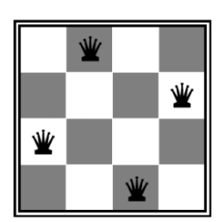
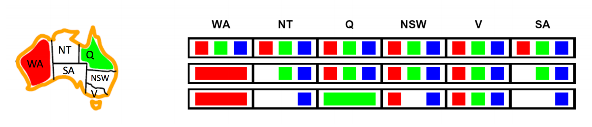

# 满足约束问题（constraint satisfaction problems）Ⅰ
## 1. CSP的三个要素的定义：
1.变量：CSP问题是由一组变量X1、X2,...,Xn组成的。
2.定义域：各个变量的取值范围。
3.约束条件：定义了对于变量值的限制，可能与其他条件相关。
   
> 考虑如下的建模问题：给定一个N × N的棋盘，我们能否找到一种配置，在棋盘上放置N个皇后，使两个皇后不互相攻击？

对于上述建模问题，我们可以依靠三要素来定义：
> 1.变量：将每个棋盘上的每一个单元视为一个变量，于是就有N*N个变量。
> 2.定义域：对于每个变量而言，其取值只能为 **{0，1}**。
> 3.约束：有以下几条约束：
> > - 每一行和每一列有且仅有一个皇后。
> > - 棋盘上任意一个正方形内皇后不能构成对角（主对角或者副对角）。
> > - 所有棋盘上的变量值加起来为N。  
 
## 2.对于CSP的解决方式：
约束满足问题传统上是使用一种称为**回溯搜索**的搜索算法来解决的。回溯搜索是一种深度优先搜索的优化，专门用于约束满足问题，其改进来自两个主要原则：  

> 1. 调整变量的顺序，并且按照此顺序为各个变量进行赋值。
> 2. 为变量赋值的时候，只选择不与任何先前赋值变量发生冲突的值，如果不存在这样的值，则回溯并返回到前一个变量，更改其值。

虽然回溯搜索是深度优先搜索的巨大改进，但我们可以通过**过滤、变量/值排序和结构利用等**进一步改进来获得更多的速度提升。

## 3. 过滤  
每当分配Xi某个值的时候，我们可以向前检查并在约束图中对新分配变量相邻的未分配变量的域进行修剪。，例如：

1. 当***指定WA为红色***的时候，NT和SA由于约束的限制，不能取得红色，这就是过滤。
2. 继续指定**Q为绿色**的时候，NT和SA由于约束，导致既不能取红色，也不能取绿色，因此只有蓝色，同时**NSW由于邻近Q**，也不能取绿色。但是由于此时只考虑了WA和Q取颜色的情况，此时**NT和SA还并未取得绿色（只是其取色域只剩下绿色）**，因此不能够排除掉NSW取得绿色的情况。

### 3.1 关于该算法(AC-3)的补充：
>  
> 算法期间 CSP 的当前状态可以看作是一个有向图，其中节点是问题的变量，变量之间有边或圆弧，这些边或圆弧由对称约束相关，其中工作列表中的每条圆弧都代表一个需要检查一致性的约束。AC-3 通过检查变量对 （x， y） 之间的弧来继续。它会从 x 的域中删除那些与 x 和 y 之间的约束不一致的值。<strong>该算法保留尚未检查的弧的集合</strong>;当变量的域删除了任何值时，指向该修剪变量的所有约束弧（当前约束的弧除外）都将添加到集合中。由于变量的域是有限的，并且每一步都删除一个弧或至少一个值，因此可以保证该算法终止。   
该算法的伪代码如下：

    Input:
        A set of variables X
        A set of domains D(x) for each variable x in X. D(x) contains vx0, vx1... vxn, the possible values of x
        A set of unary constraints R1(x) on variable x that must be satisfied
        A set of binary constraints R2(x, y) on variables x and y that must be satisfied
    
    Output:
        Arc consistent domains for each variable.
    
    function ac3(X, D, R1, R2)
        // Initial domains are made consistent with unary constraints.
        for each x in X
            D(x) := { vx in D(x) | vx satisfies R1(x) }   
        // 'worklist' contains all arcs we wish to prove consistent or not.
        worklist := { (x, y) | there exists a relation R2(x, y) or a relation R2(y, x) }
    
        do
            select any arc (x, y) from worklist
            worklist := worklist - (x, y)
            if arc-reduce (x, y) 
                if D(x) is empty
                    return failure
                else
                    worklist := worklist + { (z, x) | z != y and there exists a relation R2(x, z) or a relation R2(z, x) }
        while worklist not empty
    
    function arc-reduce(x, y)
        bool change = false
        for each vx in D(x)
            find a value vy in D(y) such that vx and vy satisfy the constraint R2(x, y)
            if there is no such vy {
                D(x) := D(x) - vx
                change := true
            }
        return change

