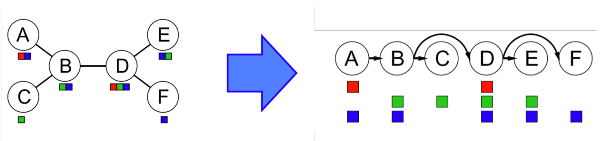
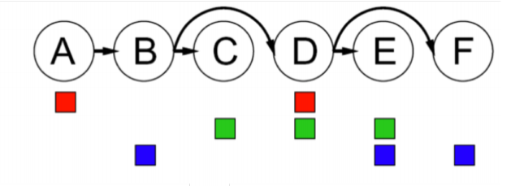
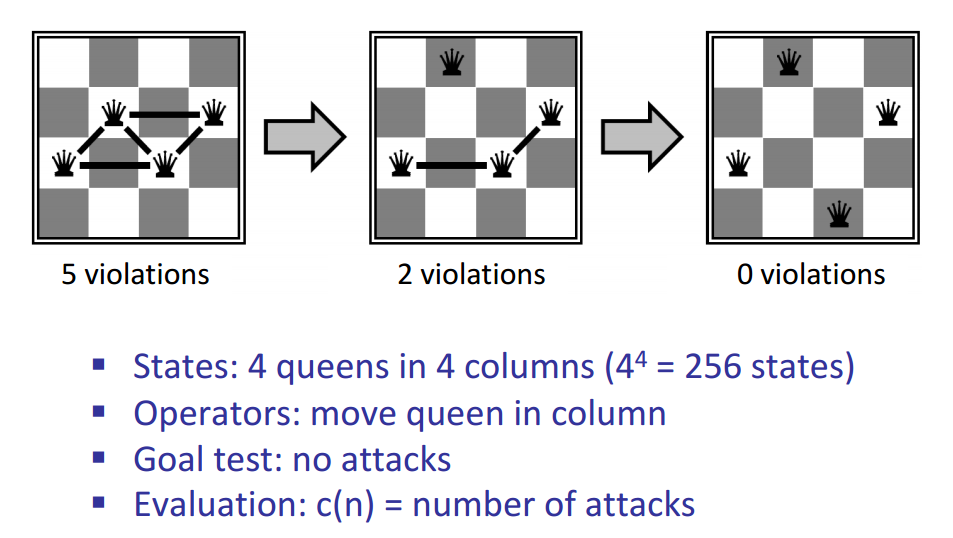
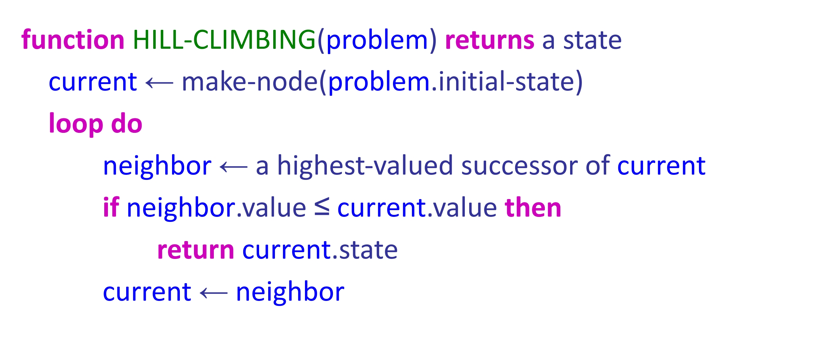
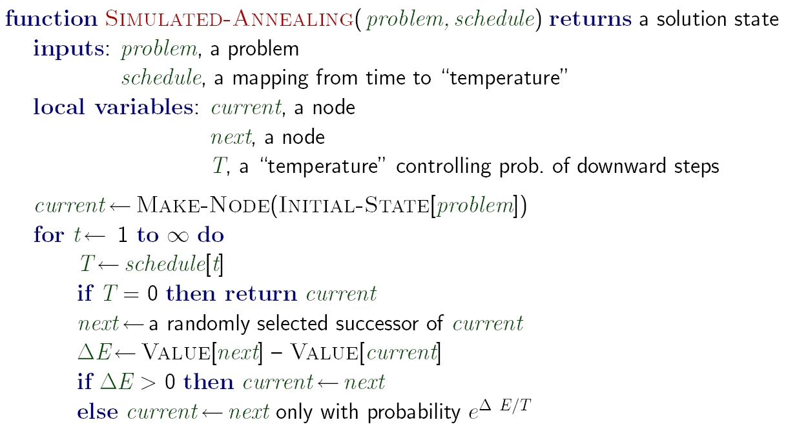

# 满足约束问题（constraint satisfaction problems）Ⅱ
## 1. 顺序（Ordering）
### 1.1 概念
&nbsp;&nbsp;&nbsp;&nbsp;在问题规划中，使用最小剩余值（**minimum remaining values**）（简称**MRV**）和最少约束值（**least constraining value**）（简称**LCV**）原则来求解问题。
> - MRV：当选择下一个变量的时候，选择**最受约束的变量（也就是可以取得的值有效值最少的变量）**（比如X1∈{1，2，3}，X2∈{1}，此时X2的有效剩余值是最少的），因为最受约束的变量最有可能耗尽可能的值，如果不赋值，就会导致回溯，因此最好尽早为其赋值。
> - LCV：在选择的**MRV**中选择一个值使得**它对其他尚未赋值的变量所产生的约束**影响最小。具体来说，就是优先选择一个能够导致最少约束冲突的值，从而减少后续决策的复杂度。
> > 例如：假设我们有一个变量 X，它的取值范围是 {1, 2, 3}，而且与其它一些变量有约束关系。如果选择 X = 1，可能会使得与之相关的变量（比如 Y）只能取少数几个值；而如果选择 X = 3，可能会让 Y 有更多可能的取值。那么，选择 X = 1 会“约束”得更少，因此被认为是最优的选择。

## 2. 结构（Structure）
> - 首先在约束图中选择任意一个节点为树的根节点。
> - 将树中所有无向边转化成远离根节点的有向边。
> > 例如：
> - 执行弧的一致**后传递**
> > 例如：根据MRC和LCV选择C为变量，然后再对C进行后传递：
> >

树的结构算法可以推广到具**切集**条件的CSP，先找到约束图中最小的的变量子集（也就是受到约束条件最多的）

## 3. 局部搜索（local search）
&nbsp;&nbsp;&nbsp;&nbsp;搜索算法是从每个状态局部移动到具有更高目标值的状态，直到达到最大值（希望是全局最大值），其时间复杂度几乎是常数级别，且有着很高的成功几率，不过**局部搜索是不完整和次优的，因此不一定收敛到最优解**。对于搜索有三种算法：爬坡算法，模拟退火算法和遗传算法。所有这些算法也用于优化任务，以最大化或最小化目标函数。
局部搜索方式（当未解决的时候）：
> 1.选择最大冲突变量。
> 2. 选择最少冲突启发值（即选择违背约束最少的值）
> 例如：
> >   

### 3.1 爬山算法（Hill-Climbing Search）
1. 任意地方开始
2. （重复）移动到最优邻近状态出  
3.  如果没有，退出
伪代码如下：

### 3.2 模拟退火搜索（Simulated Annealing Search）
&nbsp;&nbsp;&nbsp;&nbsp;原理：算法在每个状态下选择随机移动。如果这一举动导致更高的目标，它总是被接受的。另一方面，如果它导致更小的目标，那么这一行动就有一定的可能性被接受。**通过允许下坡移动来避免局部最大值，但随着时间的推移使其变得更少**。
伪代码如下：

### 3.3 遗传算法（Genetic Algorithms）

