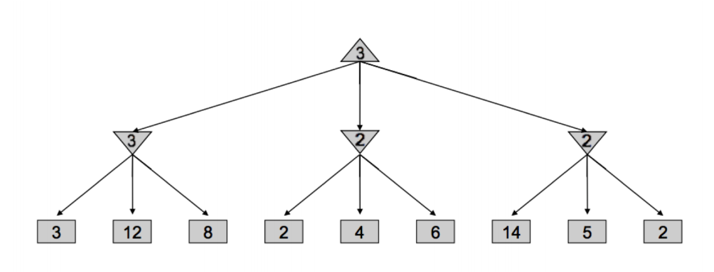
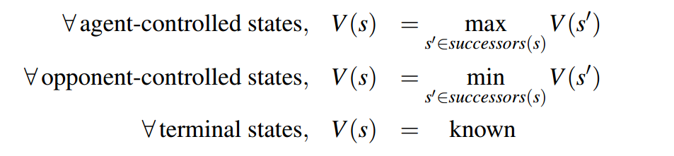
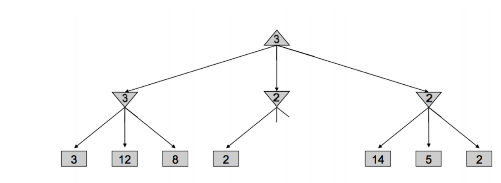
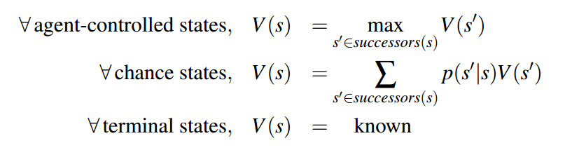
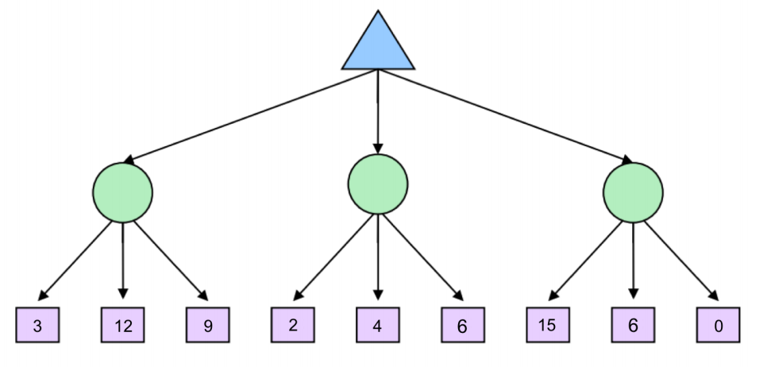
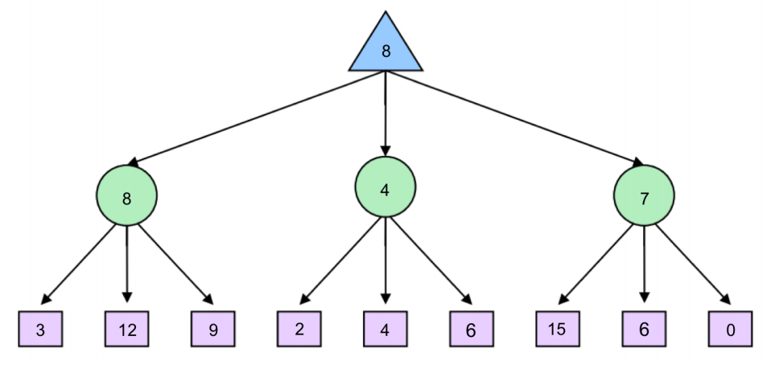

# Game
## 1. minimax search(最大最小搜索)
- 是对抗游戏中最基本的思想
- 该算法倾向于最大化自己的得分，最小化对手的得分，例如：
  
  其中上三角表示最大化该节点的子节点，倒三角则是最小化，即：
  
- 递归的进行该过程，直到结束为止。
### 1.1 alpha-beta修剪
由于需要遍历所有的节点，因此其时间复杂度非常高，因此可以选择性的挑出不必要的的节点进行删除，可以发现最小化搜索**2**的子节点的时候，左支第一个为2，因此父节点的最小值不可能高于2，然而最大化根节点的子节点的时候，由于遍历的第一个左支的值为3，因此最大值不可能小于3，由于**第二层中间节点的值不可能高于2，因此中间节点的子节点可以停止遍历了**（因为再怎么遍历该节点最小化的值也不可能比2大，小于3，自然也选不上），用图形说明就是：

## 2. 期望搜索
Expectimax在游戏树中引入了机会节点，而不是像最小化节点那样考虑最坏情况，而是考虑平均情况。算法如下：

其中, p(s′|s) 指的是给定的不确定性行动导致从状态s移动到状态s ’的概率，用一下的例子加以说明：

（补充：圆形节点称作为机会节点）
假定每一个机会节点的子节点概率都是均匀的（1/3），那么左1机会节点的值为**3·1/3+12·1/3+9·1/3=8**，以此算出各个机会节点的值，可得：

## 3. 蒙特卡洛树搜索（Monte Carlo Tree Search）
选择（selection）：算法从搜索树的根节点开始，向下递归选择子节点直到到达叶子结点或者到达还具有未被扩展的子节点的节点 L，向下递归选择的过程可由 UCB1 算法来实现，在递归选择过程中记录下每个节点被选择的次数和每个节点得到的奖励均值
扩展（expansion）：如果节点 L 还不是一个终止节点，则随机扩展它的一个未被扩展过的后继边缘节点 M
模拟（simulation）：从节点 M 出发，模拟扩展搜索树，直到找到一个终止节点
反向传播（back propagation）：用模拟所得结果回溯更新模拟路径中 M 及以上节点的奖励均值和被访问次数