# 不确定搜索
## 简述： 
#### 给定当前状态，未来和过去则是独立的
#### 行动结果仅取决于当前状态 
放置代理的环境可能使代理的行为具有不确定性，这意味着在某些状态下采取的操作可能导致多种可能的后续状态。
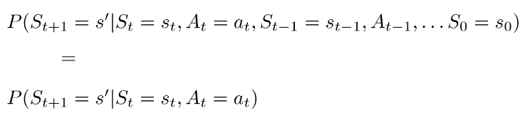
即$T(s,a,s^{\prime})=P(s^{\prime}|s,a)$
## 1. 马尔可夫决策过程（Markov Decision Processes）
马尔可夫决策过程定义如下：  
- 一组状态S（MDP的状态表示方式和传统搜索问题的状态表示方式一样）
- 一组操作A（也与传统表示方式一致）
- 起始状态
- 可能的**一个或者多个**终止状态
- 可能的一个**折现因子(discount factor)γ**  
- 一个**过渡函数***T(s,a,s′)*，实质上是一个概率函数，**表示智能体从状态s采取行动a最终进入状态s'的一个概率**  
- **奖励函数***R(s,a,s′)*，通常，MDP在每一步都有小的“生存”奖励，以奖励代理的生存，以及到达最终状态的大奖励。奖励可能是积极的，也可能是消极的，这取决于它们是否有利于所讨论的代理，代理的目标自然是在到达某个终端状态之前获得可能的最大奖励

此外可以用U来表达奖励函数的总和：
$$U([s_0,a_0,s_1,a_1,s_2,...])=R(s_0,a_0,s_1)+R(s_1,a_1,s_2)+R(s_2,a_2,s_3)+...$$

### 1.1 有限视界与折现（Finite Horizons and Discounting）
将折扣因子引入到奖励函数中，具体说就是，折现因子为γ，在时间步长为t时刻将状态st采取行动at后并进入到状态st+1,则奖励函数用**γtR(st,at,st+1)** 代替掉原来的奖励函数 **R(st,at,st+1)**（即初始状态t=0时奖励函数仍然是R(st,at,st+1)）

因此，加入折扣因子之后，奖励函数发生变化，其总和也发生变化：
$$\begin{aligned}U([s_0,s_1,s_2,...])&=\quad R(s_0,a_0,s_1)+\gamma R(s_1,a_1,s_2)+\gamma^2R(s_2,a_2,s_3)+...\\&=\quad\sum_{t=0}^\infty\gamma^tR(s_t,a_t,s_{t+1})\leq\sum_{t=0}^\infty\gamma^tR_{max}=\boxed{\frac{R_{max}}{1-\gamma}}\end{aligned}$$
其中Rmax就是MDP中任意给定时间步时可获得的最大可能奖励。
### 1.2 求解MDP
#### 1.2.1 贝尔曼方程（The Bellman Equation）
在介绍贝尔曼方程的时候，首先引入两个概念：
- 状态s的最优值U*(s)————s的最优值是在s中开始的行为最优的智能体在其剩余生命周期内将获得的效用的**期望值**。
- Q-state(s,a)的最优值Q*(s,a)————即智能体从s处开始，采取行动a，并从此采取最优行动后所获得的期望值。

有了上述概念以后，定义Bellman方程如下：

$U^*(s)=\max_a\sum_{s^\prime}T(s,a,s^\prime)[R(s,a,s^\prime)+\gamma U^*(s^\prime)]$

定义Q*(s,a)如下:

$Q^*(s,a)=\sum_{s^{\prime}}T(s,a,s^{\prime})[R(s,a,s^{\prime})+\boldsymbol{\gamma}U^*(s^{\prime})]$

即:

$U^*(s)=\max_aQ^*(s,a)$

#### 1.2.2 贝尔曼方程的详解
贝尔曼方程通过查找递归结构来将一个问题分解成若干个小问题的搜寻问题，对于式子
$Q^*(s,a)=\sum_{s^{\prime}}T(s,a,s^{\prime})[R(s,a,s^{\prime})+\boldsymbol{\gamma}U^*(s^{\prime})]$
可以理解为在s处，对于所有的下一个状态s'，取行动a到达s'状态，然后采取最优行动后所获得的费用总效益。
### 1.3 值迭代(Value Iteration)
时间限制为k步的状态s的时间限制值记为Uk(s)，表示在考虑的马尔可夫决策过程终止于k步的情况下，从s可获得的最大期望效用。
$\forall s,U_{k+1}(s)=U_k(s).$它的运作方式如下：
> 1. ∀s ∈ S,初始化U0(s) = 0，（因为设置0个时间步骤意味着在终止之前不能采取任何行动，因此无法获得奖励）。
> 2. 重复以下更新步骤在，直到收敛：
> $\forall s\in S,U_{k+1}(s)\leftarrow\max_a\sum_{s^{\prime}}T(s,a,s^{\prime})[R(s,a,s^{\prime})+\gamma U_k(s^{\prime})]$
> **在值迭代的第k次迭代中，我们对每个状态使用极限k的限时值来生成极限（k +1）的限时值。**

现用一个例子来加以说明：
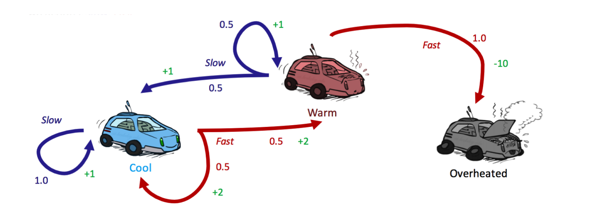
我们通过初始化所有U0(s) = 0开始值迭代：
|  |cool|heat|overheated|
|:--|:--:|:--:|:--:|
|U0|0|0|0|

第一轮迭代中，可以这样表示：
    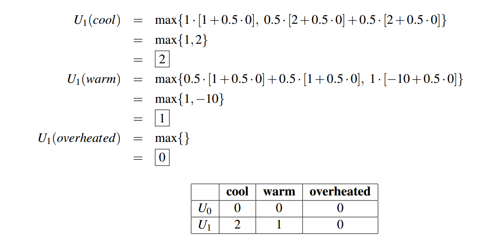
同样的，我们可以重复该过程继续迭代：
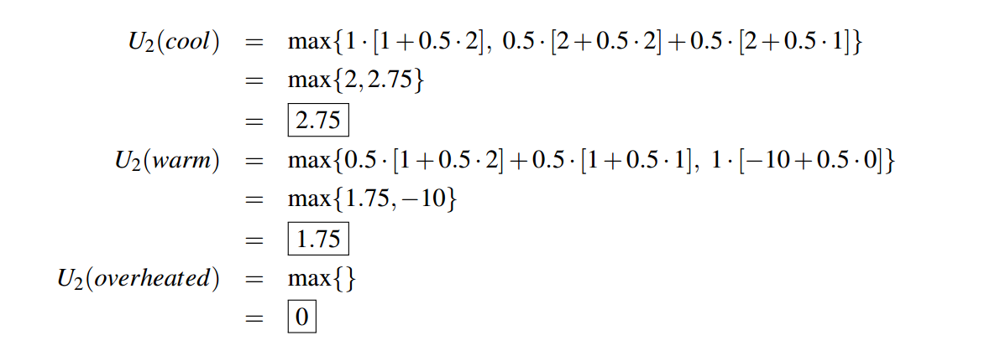
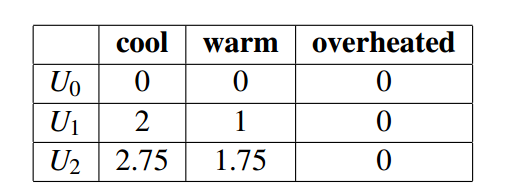
值得注意的是，**任何终端状态的U * (s)都必须为0，因为任何终端状态都不可能采取任何行动来获得任何奖励**
### 1.4 原理
通过贝尔曼方程可以很清楚的得知：对于解决MDP问题而言，最终目标是找到最优策略，如果处于s态，要想达到最优策略，则应该采取产生最优行动a，即：
$\max_a\sum_{s^\prime}T(s,a,s^\prime)[R(s,a,s^\prime)+\gamma U^*(s^\prime)]$
## 2. 策略提取
策略提取的思想就是：当我们处于s状态的时候，则应该采取产生最大预期作用的操作a，即：a是使我们达到q值最大的q-state的行为，定义为：
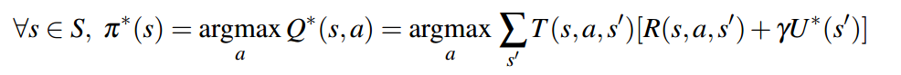
最优策略
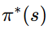
"argmax" 是一个数学符号，表示“使得某个函数最大化的变量”的意思。
### 2.1 Q-Value迭代
在使用值迭代求解最优策略时，首先找到所有最优值，然后使用策略提取方法提取策略。
q值迭代是一种计算有时间限制的q值的动态规划算法，用法如下：
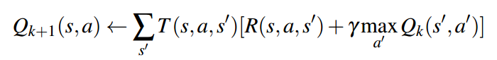
### 2.2 策略迭代
值迭代较慢，但是策略迭代能够在保持值迭代最优性的前提下还能够提升速度，操作如下:
1. 定义一个**任意的**初始策略，若迭代收敛得越快则证明初始策略越接近最终的最优策略。
2. 重复以下步骤直到收敛：
   > - 用策略评估来评估当前的策略，对于一个策略Π，策略评估意味着计算所有状态s的UΠ(s),其中UΠ(s)是从状态s开始的期望效用：
   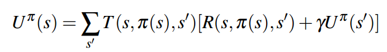
   定义策略迭代第i次迭代时的策略为Πi,我们也可以像值迭代一样，用以下更新规则计算Uπi(s)，直到收敛：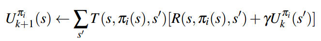
   > - 一旦我们评估了当前策略，使用**策略改进**来产生更好的策略：
   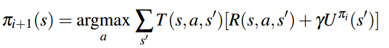
   当πi+1=πi时，该算法收敛，我们可以得出πi+1=πi=π*。

例如：我们从初始策略slow开始（初始策略随便取得，只是会影响收敛的快慢）：
| |cool|warm|overheated|
|:--:|:--:|:--:|:--:|
|Π0|slow|slow|-|

下一步是在Π0上进行一轮的策略评估：
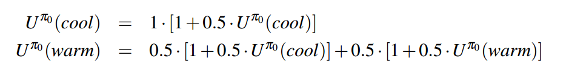
解得方程为：
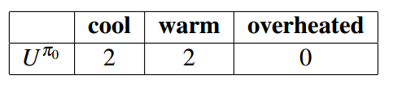
再进行策略提取：
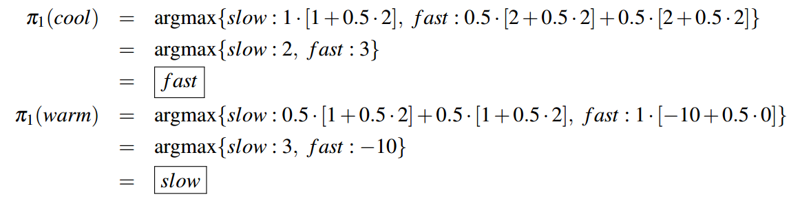
第二轮运行得到：
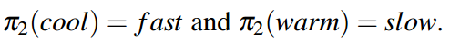
这与第一轮Π1是相同的策略，我们可以得出Π1=Π2=Π*
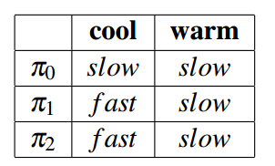
## 3. conclusion
- 值迭代：用于计算状态最优值，通过更新迭代来达到收敛。
- 策略评估：用于计算特定策略下的状态值。
- 策略提取：用于确定给定一些状态值函数的策略。如果状态值是最优的，则此策略是最优的。
- 策略迭代：用于迭代收敛到最优策略。它往往优于值迭代，因为策略通常比状态值收敛得快得多。