# 强化学习（Reinforcement Learning）
## 1. 概念
强化学习分为**有模型强化学习**和**无模型强化学习**,有模型强化学习依赖于环境的转移函数和奖励函数，智能体可以利用这些信息进行规划和模拟，从而提高决策效率。无模型强化学习则不依赖环境模型，而是通过与环境的交互直接学习最优策略。尽管它的数据效率较低，但其灵活性较强，适用于更复杂或难以建模的环境。**即有模型简化了决策，而无模型则简化了建模。**
### 1.1 有模型强化学习（Model-Based Learning）
在基于模型的学习中，通过记录各个q状态（s,a）后达到s'的次数,智能体来生成一个过渡函数的近似值T(s,a,s'),假定数据集通过下面这些数据来生成一系列的结果:
> 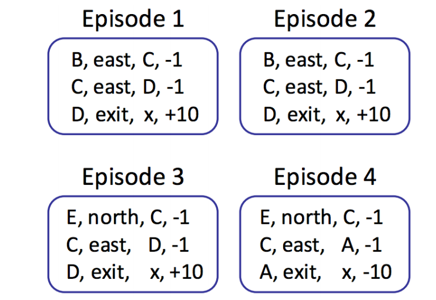
> 此时可以得到下述数据集：
> 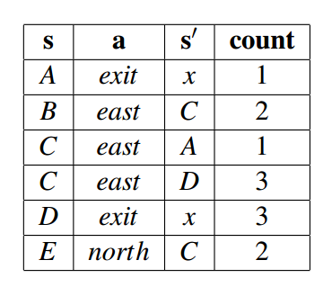
> 通过次数可以得到：
> 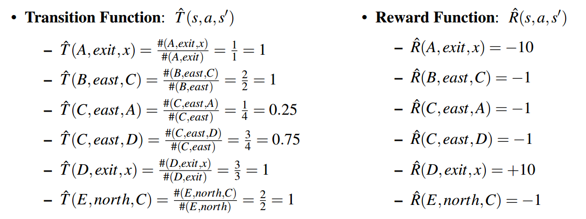
> 根据大数定律，可以得知：
> 当数据集足够多的时候，我们的转换函数T(S,A,S')和奖励函数R(s,a,s')都会得到改善，最终趋向于期望值
>
### 1.2 无模型强化学习（Model-Free Learning）
有三种：直接评估、时间差异学习和q学习，其中直接评估和时间差异学习属于被动强化学习算法的一类。**被动强化学习**是指智能体（Agent）在学习过程中无需**主动采取决策或采取某种策略**来最大化其回报，而是根据环境中固定的策略（通常是已知的或提供的策略）进行学习。
#### 1.2.1 直接评估
直接评估通过每次保存获得的总奖励和状态次数进行挂钩，例如：
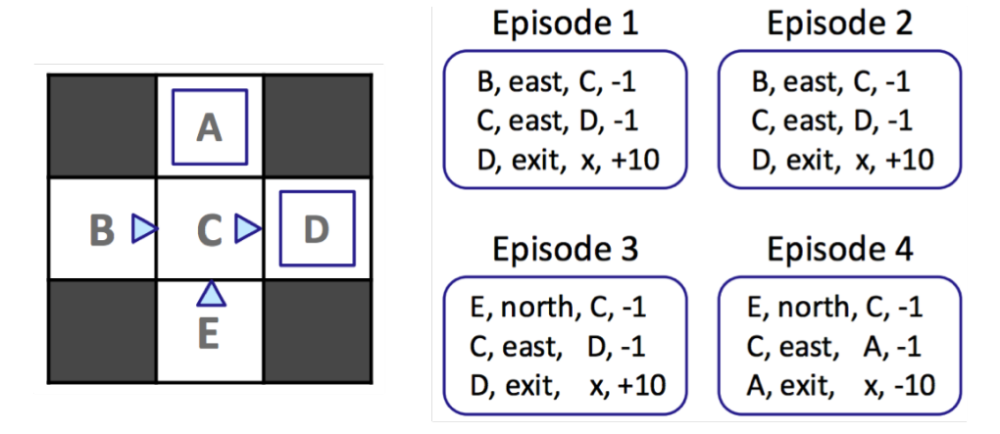
**对于该图而言,从B到最终总共有2次，分别为8和8，因此总奖励为16，则平均最优策略值VΠ为16/2=8，类似的，C到最终有4个方案，C到D有三种均为-1，D到x为10，所以总奖励为9；C到A有一种为-1，A到x为-10，所以总奖励为-11.再对上述奖励进行加法，可以得到：9×3-11=16，所以Total reward为16，平均最优策略值VΠ为16/4=4.** 结果如下表所示：
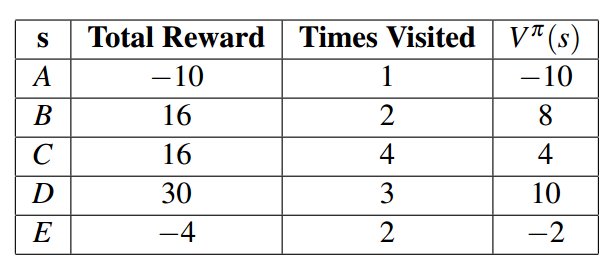
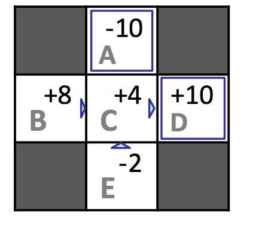
但是从上图中可以发现:VΠ(B)和VΠ(E)并不相同，根据Bellman方程，这意味着B和E在Π相同的条件下应该具有相同的Value.因此要引入时间差学习。
#### 1.2.2 时间差学习（Temporal Difference Learning）
在策略评估中，我们主要使用Bellman方程生成的方程系统来确定该策略下的状态值:
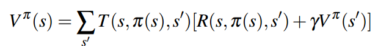
在没有转换函数的条件下，智能体可以使用指数移动平均来巧妙的解决这个问题，先初始化VΠ(s)=0,在每个时间步，智能体会采取一个动作Π（s），过渡到s'，并获得奖励R（s，Π（s），s'）,因此可以得到一个样本值:

这个样本值就是我们对于新的VΠ(s)的一个估计样本，下一步就是将它与指数模型结合起来，即：
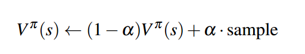
其中α为学习率，取0-1之间，比如第一个样本学习率为1，第二个样本学习率为0.9，等等，这个α也表明了我们对于学习的权重，当α为0的时候，证明停止学习。
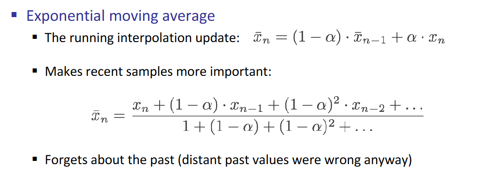
现在我们**重新定义一下更新规则**，定义Vπk (s)和samplek分别为**状态s在第k次更新后的估计值和第k个样本后的估计值来标注模型在不同时间点的状态**，我们可以重新表示我们的更新规则：
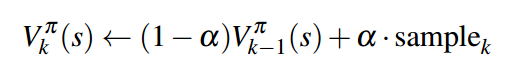
展开结果如下：
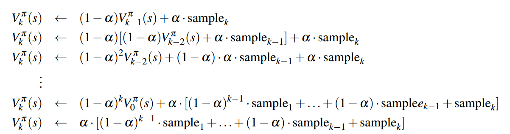
上述都在说明：**旧样本的权重会随着训练的迭代次数不断地降低**
#### 1.2.3 Q-Learning
Q-Value（或 Q函数）是一个关键概念，通常用于表示***在某一状态下采取某一动作的价值***。具体来说，Q-Value 是对未来回报的预估，它告诉我们：在给定状态下执行某个动作，未来能够期望获得的累积奖励是多少。
与时间差学习方式类似，该方式基于之前学过的这个公式：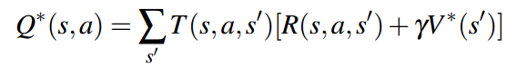
由于Q-Learning是基于无模型的，因此Q值迭代具体实现规则为 **（并非Q-Learning无模型的迭代公式，以下仍然是有模型的迭代公式，只是无模型的迭代规则和他一样）** ：
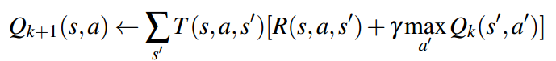
有了这个新的更新规则，Q-learning的推导方式与TD学习基本相同，即通过获取Q值样本：
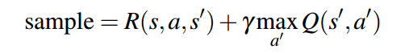
并将其纳入指数移动平均数 **（以下才是真正的Q-Learning无模型学习迭代公式）**：
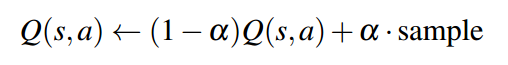
只要我们花足够的时间进行探索，并以适当的速度降低学习率α， Q-learning就能学习到每个Q状态的最优Q值。这就是q学习如此具有革命性的原因——当TD学习和直接评估在通过其他技术确定策略最优性之前，通过遵循策略来学习策略下的状态值时，**Q-Learning**甚至可以通过采取次优或随机行动直接学习最优策略。这被称为政策外学习（与直接评估和TD学习相反，后者是政策上学习的例子）。
#### 1.2.4 Approximate Q-Learning(近似Q学习)
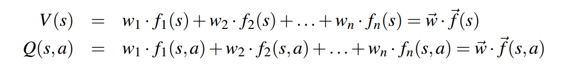
其中f(s)和f(s,a)分别为状态和Q-State的特征向量，w为权重
**这个类似于机器学习中的线性回归**
将差值定义为：
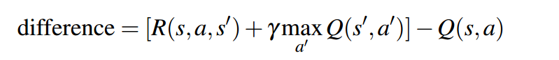
近似q学习的工作原理与q学习几乎相同，使用以下更新规则：
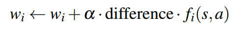
关于Q-learning的最后一点说明，我们可以用差分重新表示精确Q-learning的更新规则，如下所示：
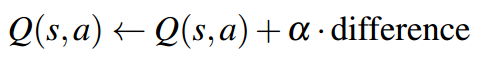
### 1.3 ε贪心策略（ε-Greedy Policies）
主要用于在**无模型**强化学习（如 Q-Learning）中选择动作，它的核心思想是，在大部分情况下（概率1−ϵ）选择当前最优的动作（利用），但偶尔（概率ϵ）随机选择一个动作（探索），以防止局部最优。
关于探索和利用：
![[Pasted image 20250309174248.png]]
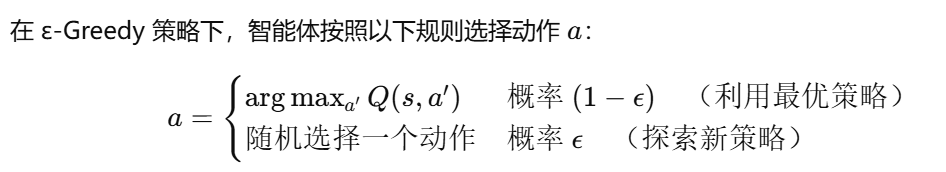
	这是一个非常简单的策略，但仍然很难处理。**如果选择了一个大的ε值，那么即使在学习了最佳策略之后，智能体的行为仍然是随机的。同样，选择一个小的ε值意味着智能体将很少探索，导致Q学习（或任何其他选择的学习算法）学习最优策略非常缓慢。** 为了解决这个问题，必须手动调整ε并随着时间的推移降低以查看结果。
##### 1.2.4.2 探索函数（Exploration Functions）
探索函数主要是为了避免手动调整ε的问题
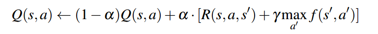
式中，f为探索函数。在设计探索功能时存在一定程度的灵活性，但通常的选择是使用
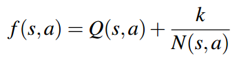

