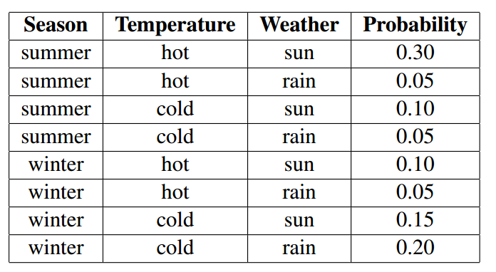
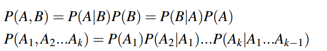
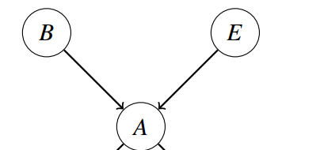
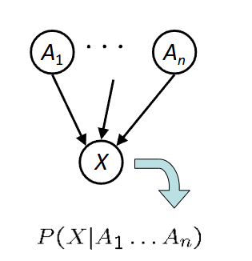
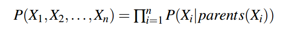
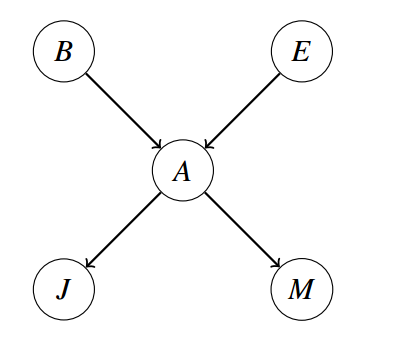
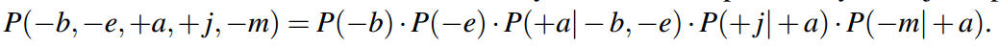
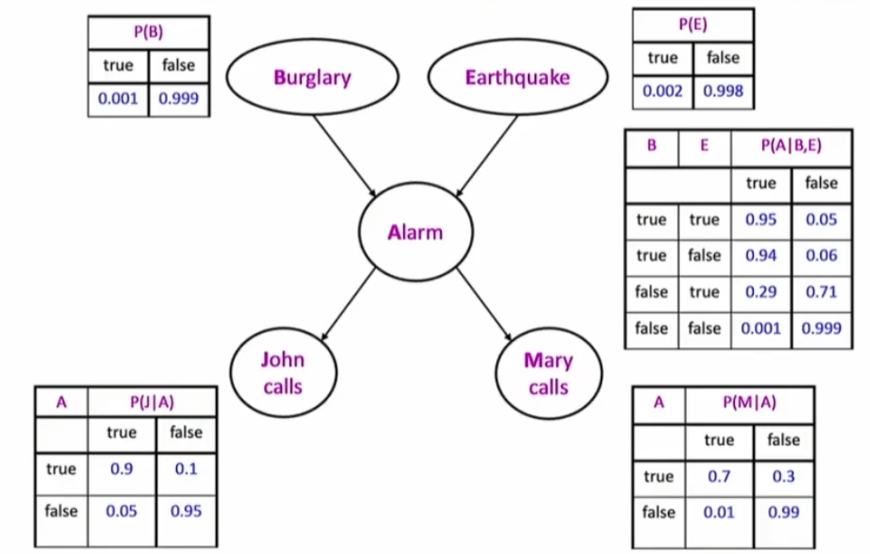
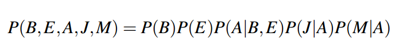

# 贝叶斯网络表示
## 1 简介
通过枚举法确实可以将联合概率分布一一表示，例如：

但是对于n个变量而言，若每个变量均可取得d个值，则联合分布表则有dn，这个数量级是非常大的,存储起来非常不切合实际，贝叶斯网络通过利用条件概率的思想避免了这个问题。**概率不是存储在一个大表中，而是分布在许多较小的条件概率表中，以及捕获变量之间关系的有向无环图（DAG）**。
## 2 补充
~~对于基础的概率论知识（比如联合概率密度等等）就不做过多的补充~~
首先来讲一下链式分解：
对于k个变量而言，其发生的概率为：

**这个无论是否独立均成立**
而当条件独立的时候(例如A2和A3独立的时候)，则有：
P(A1,A2,A3)=P(A1)·P(A2|A1)·P(A3|A1,A2)
其中P(A3|A1,A2)=P(A3|A1)
所以原式等于：
P(A1,A2,A3)=P(A1)·P(A2|A1)·P(A3|A1)
***根据这个条件概率表（CPT）我们就可以搭建贝叶斯网络！！！（贝叶斯网络 /图形模型帮助我们表达有条件的独立假设）***
## 3 贝叶斯网络
> 一种使用简单的本地分布（条件概率）来描述复杂联合分布（模型）的技术
> > - 更恰当的称为图形模型

### 3.1 表示
我们通常定义贝叶斯网络为:
1. **一个节点的有向图，其中每个变量为一个节点**
2. **每个节点上的条件分布**：

证明P(A,B)=P(B)·P(A|B),对于E，也是和B同样的表示方式。

该节点X上存储的概率为条件概率。
给定图的所有cpt，我们可以使用以下规则计算给定分配的概率：

例如这个模型

其对应的联合概率为：

### 3.2 存储方式
根据上述可知：对于bayesNet而言，**每个节点表示一个变量，且里面存储的是该变量的条件概率，且该条件概率仅涉及到其parentNode**，因此可以用这张图来表示bayesNet：

比如B节点表示B变量，里面存储了P(B)的**条件概率分布**，由于其没有**parentNode**，因此只有其概率，无条件概率。
### 3.3 markov blanket（马尔科夫毯）
markov blanket是指一个节点与其他节点之间的一个耦合关系，通常而言，一个Markov blanket包含了：
> - 父节点；影响该节点的输入
> - 子节点：该节点影响的输出。
> - 子节点的父节点：影响该节点的节点。

既可以这样展开：

也可以这样展开：

